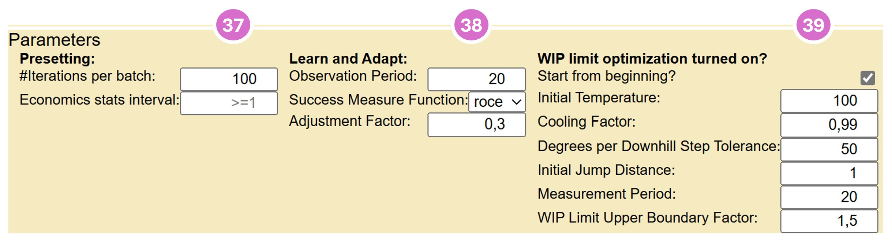

LONELY LOBSTER
==============
***Simulating the effects of sharing critical resources over multiple value chains***  
Gerold Lindorfer Dec 2024, gerold@lindorfer.com

# Lean Manufacturing
Since the beginning of industrialization at the end of the 18th century, the production of goods for almost all areas of life has steadily increased in efficiency. Factory-based mass production has continuously increased the quantity and quality of the goods produced and at the same time reduced unit costs. Our material prosperity today is based on it.

What makes mass production in factories so efficient? Among other things, 
* A clearly defined, standardized sequence of work stations through which a workpiece passes. As a rule, this sequence is linear, i.e. workpieces pass through a chain of work stations, each of which has exactly one predecessor and one successor. Exceptions are the first work station (has no predecessor) and the last (has no successor). This sequence of work steps is often referred to as a value chain, as the work in each step contributes to the value of the workpiece.  
* In each workstation, only a few specialized work steps are carried out on the workpiece. In the process, (further) raw materials or intermediate products from other value chains can also be included and integrated and processed with the workpiece. 
* Once all the work at a workstation has been completed, the workpiece is passed on to the next workstation or “picked up” from it. From the last workstation, the end product is handed over to the market, customer or consumer.
* In order to be able to carry out the specific work steps in a work station, it is assigned trained workers, who are specialized in the work steps, the necessary materials and usually supporting machines. The work steps are carried out according to a method specified for the workstation. Measurements and the KPIs derived from them provide continuous information, e.g. on efficiency, quality, workload, etc. See [The 5Ms of Lean Manufacturing](https://theleansuite.com/the-5-ms-of-lean-manufacturing): Manpower, Material, Machines, Methods, Measurments.
* Strict adherence to measures that ensure high reliability and quality in every work step in order to avoid additional costs for the elimination of avoidable processing defects and rejects.  See e.g. [Six Sigma](https://de.wikipedia.org/wiki/Six_Sigma).
The organization of efficient mass production is scientifically well understood and many derived procedures and proven best practices are now well established in most manufacturing operations around the world. The umbrella term 
[Lean Manufacturing](https://en.wikipedia.org/wiki/Lean_manufacturing) summarizes the knowledge about the organization of efficient production.

# Advantages of lean manufacturing: 
If a production line, i.e. the facilities in a factory that represent the value chain by means of work stations, is organized according to lean manufacturing principles, a number of advantages arise:
* Good utilization of the resources used, i.e. machines, materials, people. The ratio of the costs of the resources used to the sales revenue generated by the end products produced is reduced, i.e. the production costs per end product are reduced, which increases the manufacturer's competitiveness.
* Lead times through the value chain are brought to a minimum. This has several positive effects:
    * If products are produced to order, then it can be ensured that the waiting time for the purchaser is minimized. The lead time from the first work step to handover to the customer is minimized. It is also easier to predict when the end product will be ready for delivery. Many customers appreciate such fast and reliable delivery and are prepared to pay more for it.
    * The more workpieces are in the value chain in an unfinished state at the same time, the more capital is tied up. Expenditure has already been incurred for the purchase of raw materials and the (variable) payment of workers, which is not yet offset by sales revenue. This expenditure, the so-called working capital, must be financed, e.g. by a loan from a bank. The higher the inventory in the production chain, the higher the need for working capital, the higher the expenses for its financing, the lower the margin achieved. The margin is the difference between the sales revenue and the costs incurred to manufacture the end product, which also includes the financing costs for the working capital on a pro rata basis. Lean manufacturing methods help to minimize lead times and the inventory of unfinished workpieces in the value chain. 
    * Minimizing inventory in the value chain also increases the agility to adapt to new demand situations. If there are only a relatively small number of unfinished workpieces being processed at any given time, it is possible to quickly switch to the production of other products without having to complete a large number of unfinished workpieces first. Upon completion, these workpieces may then find a market with little interest and can only be sold at a large discount. In contrast, lean manufacturing helps to bring new products to market quickly.
    * There are always situations in which there are temporarily more new orders than the value chain can process. A queue of orders (backlog) forms, waiting to be processed. In value chains that start processing all orders immediately, this leads to congestion in the value chain: unfinished workpieces pile up in front of overloaded workstations with negative effects such as poorer predictability of the completion time and longer average lead  times. If a particularly important and lucrative order comes along that should be given priority over other orders, it is difficult to speed it through the congested value chain. Work on workpieces from other orders in the work stations would have to be stopped, the workpieces put aside and work on the new workpiece started. Work on the workpieces that had been set aside would then have to resume again. This results in additional set-up times and therefore more work. In addition, any such deviation from the normal process increases the risk of quality problems and production disruptions, which in turn has a negative impact on throughput times and costs. However, if the value chain is organized according to lean manufacturing principles, the start of processing an order is held back until it is certain that the throughput time is as short as possible. A decision can be made in the backlog - i.e. before any work has gone into the order - as to which orders that are not yet being processed can be postponed in favor of the new order and the new order can then move quickly through the value chain without further intervention.

Various practices are used to realize the benefits of lean manufacturing described above. One of the most important is the “limitation of unfinished work” (“Work in Progress Limits” or WIP Limits for short) and the pull principle, see [Kanban and WIP Limits](https://en.wikipedia.org/wiki/Kanban_(development)).

# Services
In modern economies, the share of services in gross national product has continued to rise over the last few decades, often in conjunction with a decline in industrial production. This type of value creation therefore plays an important role in maintaining or increasing prosperity in post-industrial societies. It is obvious that, as in industrial production, services must also strive for high efficiency and quality in order to remain competitive.

In industrial production, the end product is a physical good that can be manufactured, stored, transported and sold (e.g. cars, machines, clothing). In services, on the other hand, the output is immaterial and often cannot be stored (e.g. consulting, healthcare, education). Services are provided by people for customers, patients, citizens, etc., often individually adapted to the needs of the recipient. In contrast to industrial production, the processing of raw materials and the use of machines play no or only a subordinate role. Nevertheless, many services have an impact on the material world, e.g. a patient being treated by a doctor, a park being landscaped by a gardening company or the cleaning of a building.  

Some services are intangible, i.e. they do not process raw materials and do not affect the physical world. Intangible services are often performed as office work: the employees involved in value creation receive work orders, often via digital channels, and process them. They use data stored in the company and in some cases also include externally available information. IT applications are usually used for processing, and AI systems will increasingly be used in the future. Once the employee has completed their work according to their skills and within the scope of their responsibilities, the intangible result generated is sent to the internal or external client.   
Value chains are also frequently used in services and office work, i.e. the immaterial order passes through a chain of workstations before the immaterial end result is handed over to the client.   

# Knowledge work
Particularly in the case of services, of which the provision places high demands on the employees, e.g. in terms of analyzing the facts, assessing them, considering options for action, selecting and applying methods, a high level of training, experience and knowledge is required in order to be able to carry out the necessary steps in the value chain quickly and to a high quality standard. It often takes years of training - possibly academic - and a long induction phase in which the employee specializes in this type of task.

# Company for complex, immaterial, knowledge-based services
The drive to increase economic productivity goes hand in hand with a growing need for specialized knowledge work, e.g. in the form of
* market analysis
* customized corporate financing
* conception and implementation of projects
* legal advice 
* development and operation of complex IT systems
* the development of customized software applications
* search for and recruitment of qualified personnel
* negotiation of individual business contracts
* tax advice
* asset management
* etc.

Companies that offer such more or less standardized services on the market must - like industrial companies - concern themselves with the internal organization of work in order to be able to deliver high-quality end results to the client reliably and on time. The question arises as to which principles a company can use to organize these services and which principles and techniques of lean manufacturing can be usefully transferred into the field of knowledge work. 

What characterizes this type of value creation and how does it differ from the industrial production of goods?

The following is a list of differences:

| No.| Dimension | Industrial production | Knowledge-based services |
| :---: | :--- | :--- | :--- |
| 1. | Importance of (raw) materials | high | none |
| 2. | Value chains in the company | few, mostly highly standardized | often many, rather moderately standardized |
| 3. | significant costs | material, employees, machines (energy, maintenance), warehousing, logistics | employees, IT systems |
| 4. | quantities in a value chain | mostly high | low |
| 5. | variance of work effort for workpieces | low | often high |
| 6. | transparency of the processing status of individual orders or workpieces | high | often lower |
| 7. | Effective processing time as a proportion of total processing time | high, often over 80%, i.e. the workpiece is being worked on for the majority of time | rarely higher than 20%; interim results remain often dormant in e-mail inboxes, task lists or, better, in workflow systems |
| 8. | assignment of employees to workstations | usually exclusive | often shared: specialist often active in several work steps in possibly several value chains |

There are several studies in the literature that deal with the question of the extent to which lean manufacturing techniques and principles can also be used in companies that offer complex, intangible, knowledge-based services. An example of this is [Havard Business Review: Lean Knowledge Work
by Bradley R. Staats and David M. Upton 2021](https://hbr.org/2011/10/lean-knowledge-work). 
These works deal with the applicability of the [The five Principles of Lean Management](https://www.6sigma.us/lean-six-sigma-articles/5-principles-of-lean/), often with a particular focus on continuous improvement and the employees. 

# A special problem
In companies providing complex, intangible, knowledge-based services, we observe often a phenomenon that causes surprise, if not frustration and anger, among employees, managers and clients: orders that have been started and have to pass through a value chain take an incomprehensibly long time to be completed, even though lean manufacturing practices are applied.

In addition to factors such as the training and skills of employees, the use of supporting technology and, in the best case, the application of continuous improvements, one of the causes lies in bottlenecks caused by specialists in the company whose (selective) involvement is required in several value chains. From the specialist's perspective, several value chains intersect on his desk, which is unfortunately too often full with too many workpieces. Even if the specialist has sufficient capacity on average to make the necessary contribution in all value chains, overload situations and thus congestion in one or more value chains quickly arise as the volume of incoming orders varies. 

This shows a difference to traditional industrial manufacturing: in manufacturing, resources, i.e. people and machines, are in most cases assigned exclusively to a single work step in a value chain. This means that there are no dependencies between value chains due to the resources. Value chains can be optimized independently of each other. The situation is different in companies that perform knowledge work and have to deploy specialists across several value chains. This phenomenon is particularly common in companies where 
* demanding orders are processed in different value chains and 
* in which the expertise of highly specialized employees is required in at least some work steps and
* whose company size does not allow them to maintain a staffing level in which sufficient specialists with the required expertise can be assigned exclusively to each value chain. 

In other words, this phenomenon is likely to affect smaller or medium-sized companies in particular. 

Examples of specialists who often have to perform the balancing act between different value chains:

| No.| Department | Contribution in value chains (some examples)|
| :---: | :--- | :--- |
| 1.| Legal department | Sales: supports in the design of offers |
| | | Complaints: assists with serious complaints and legal disputes with other companies |
| | | Supplier contracts: assesses commercial terms and conditions of suppliers |
| 2.| Accounting | Creating new orders in accounting |
| | | Annual financial statements: preparing the balance sheet |
| | | Deferrals of receivables: Adjustments to payment plans |
| 3.| HR | Recruiting: Assessing candidates |
| | | Recruiting: Creating job vacancies and publishing them on suitable social media channels |
| | | Recruiting: participation in job fairs |
| 4.| IT administration | Operations: monitoring systems and applications and take action when necessary |
| | | Projects: Designing and implementing infrastructure for new applications |
| | | Planning: Estimating budget requirements for operation, maintenance and, if necessary, renewal of systems |
| 5.| Control functions / compliance | Introduction of new systems / applications: Data protection check |
| | | Introduction of new systems / applications: Assess IT security and develop measures with IT |
| | | Introduction and operation of applications: ensuring regulatory compliance |

# Lonely-Lobster
The Lonely-Lobster software project aims to systematically research the fundamental effects and interactions in such companies. The Lonely-Lobster application offers the possibility to define systems with several value chains, each with several work steps, in an idealized way and abstracting from many details of real-life business. It also allows you to assign employees to one or more work steps and control the inflow of new work orders. Lonely-Lobster simulates the processing of the (immaterial) workpieces and visualizes them. Statistics and KPIs are calculated and displayed to evaluate the efficiency of the system. In particular, it allows the following questions to be addressed:
* How should the inflow of new work orders into the system and into individual workstations be controlled in order to achieve the best possible result for the company?
* How should individual employees behave when they have several unfinished workpieces to process? Which workpiece should they select for processing next? 
* In particular, how should they make the selection when workpieces from different work steps from possibly different value chains are available to them for processing? 
* What effects do different selection strategies have on the efficiency of the overall system?     

## Terminology
In tis documents, the following terms are used:
| Term | Definition | Synonyms |
| :--- | :--- | :--- |
| Worker | an employee | processor |
| Work Item | workpiece | |
| Inventory | a collection of work items |  |
| Output Basket | is the inventory of all end products |  |
| Process Step | Work station in which the assigned workers perform the necessary work on work items in the inventory of the process step until the work item can move on to the next process step or finally to the output basket. | Work station |
| Buffer | A special kind of Process Step where norm-effort is 0, i.e. no work is done in the process step, it justs serves as a buffer that can temporaily hold work items | Intermediate storage |
| Value chain | consisting of at least one, usually several process steps. | Production line |
| System | Executable system consisting of at least 1 value chain and 1 worker. A system also has further setting options (system parameters). | | 
| Configuration | Definition of a system with its value chains, workers, strategies, system parameters; can be uploaded as a JSON file to the Lonely-Lobster frontend or exported (again) to the local download directory after creation or modification. Configurations can be created and revised in the Lonely-Lobster Editor.  |  |
| Editor | is a function in the frontend that allows users to create and edit configurations. 
| Work Order | A work item that is entered into the first process step of a value chain. | |
| Injection | The process of feeding work orders into a value chain. | | 
| End Product | a work item whose processing in its value chain has been completed and which has been transferred to the output basket. |  |
| Time Unit | period of time: time passes in discrete steps in Lonely-Lobster. Time starts at 0 and is incremented with each iteration.  | Time |
| Iteration | The next system state is calculated from the current system state with all its work items and workers. In doing so, time advances by one time unit. |  |
| Iteration Batch | Automatic execution of several iterations at once without the user having to take action.  |  |
| Effort | Effort, i.e. the number of time units that workers have worked on a work item. Workers can work on a work item for no or one effort unit per time unit. A work item can only be processed by one or no workers in a time unit. A work item with Norm Effort greater than one can be processed by several workers over several time units. There are never multiple workers working on the work item at the same time. |  |
| Norm Effort | Effort for the necessary work that workers have to exert on a work item in a process step until it can be passed on to the next workstation or the output basket. | |
| Interval | Time span back into the past measured in time units; a value of 0 means from the beginning, i.e. Time 0. | Observation Period, Measurement Period |
| Utilization | Utilization of a worker over the interval; utilization is calculated as the proportion of TimeUnits in an interval in which the worker worked on work items. If the proportion is less than 50%, the name is displayed in light green, up to 80% green, up to 90% orange, and red above that. | |
| Value | the revenue generated by the end product with the customer or on the market. Since Lonely-Lobster is based on immaterial knowledge work and the purchase of raw materials is not necessary, the value corresponds to the added value achieved in the value chain. | Value-add |
| Costs | cost for the effort expended, if the worker costs are variable, i.e. if the workers are only remunerated for TimeUnits where they work on a work item. Thus, cost corresponds to the sum of the effort expended. If a work item is in the output basket, the effort expended corresponds to the sum of all norm efforts of the process steps in the value chain. With fixed worker costs, i.e. with a pool of permanent employees, the costs arise from the passing of time, regardless of how often the worker has worked on work items. Note: Effort and value have the same unit of measurement in Lonely-Lobster. | | 
| Strategy | Strategy by which a worker selects one of several work items in the current time unit for processing. | Long form: Work Item Selection Strategy | 
| Sort Vector | Strategies consist of a list of sort vectors. The way sort vectors work is explained in the section __Editor: Globally defined Work Item Selection Strategies__. | |
| WIP Limit | The maximum number of work items allowed in a process step. This also includes work items completed in the process step. Note: in Lonely-Lobster, the value 0 means that **no** limit is set.  | Work in Progress Limit |
| Cycle Time | The time a work item takes to pass through a value chain or process step, measured from injection into the value chain or process step to the point at which it leaves it. |  |
| Flow Statistics | Cycle Time and Throughputs of a Value Chain or in a Process Step |  |
| Elapsed Time | time elapsed since a work item was added to its value chain as a work order via __injection__, or the time elapsed since the work item arrived at a process step |  |
| Discounted Value  | reduced value that can be realized with the customer or on the market. The value may change the longer the customer or the market has to wait for delivery. In Lonely-Lobster, you can set how the value changes depending on how much the effective cycle time exceeds the minimum cycle time, i.e. the effort of the value chain (delay).|  |
| Value Degradation | defines how the actual value of an end product changes depending on its delay. There are three value degradation functions to choose from: __net__: the value does not change; __discounted__: the end product loses a percentage of its value for each unit of delay; __expired__: the end product retains its value completely as long as the delay is less than the set expiry period, after which the value is 0. | Value Degradation Function |
| Contribution Margin | The difference between the (discounted) value realized for an end product and the effort invested in achieving it. | |
| Throughput | Over an interval, the number of Work Items that have been completed on average per time unit in a process step or value chain i.e. TPI ("ThroughPut in Items"). Throughput can also be measured based on the __Discounted Value__ i.e. TPV ("ThroughPut in Value")  |  |
| ROCE | Return On Capital Engaged: the cumulative cost in the system at a given point in time for all work items that are not yet an end product, in other words, those that are still in the process in their value chain. “ROCE fix” is calculated on the basis of a fixed workforce, “ROCE var” on the assumption that only work actually performed on work items is remunerated.  |  |
| Frontend | The user interface of Lonely-Lobster that runs in the user's browser  |  |
| Backend | The part of Lonely-Lobster that runs in the cloud and can execute a system as defined by the current configuration |  |

## The User Interface - Overview
Here is the Lonely-Lobster user interface with an example configuration that can be run as a system:  
  
The individual sections of the user interface are described below.

### Application Control Bar

| Label | Explanation | Details |
| :---: | :--- | :--- |
| 1 | Here you find 8 symbols from left to right:  | <svg xmlns="http://www.w3.org/2000/svg" height="24px" viewBox="0 -960 960 960" width="24px" fill="#5f6368"><path d="M240-200h120v-240h240v240h120v-360L480-740 240-560v360Zm-80 80v-480l320-240 320 240v480H520v-240h-80v240H160Zm320-350Z"/></svg> __Home__: shows some basic  information about Lonely-Lobster |
|   |   | <svg xmlns="http://www.w3.org/2000/svg" height="24px" viewBox="0 -960 960 960" width="24px" fill="#5f6368"><path d="M440-320v-326L336-542l-56-58 200-200 200 200-56 58-104-104v326h-80ZM240-160q-33 0-56.5-23.5T160-240v-120h80v120h480v-120h80v120q0 33-23.5 56.5T720-160H240Z"/></svg> __Upload__: upload a configuration JSON file from the file system into the Lonely-Lobster-Frontend. You find example configuration files in [Configuration samples](https://github.com/FastFurios/Lonely-Lobster-UI/tree/main/samples) |
|   |   | <svg xmlns="http://www.w3.org/2000/svg" height="24px" viewBox="0 -960 960 960" width="24px" fill="#5f6368"><path d="M200-200h57l391-391-57-57-391 391v57Zm-80 80v-170l528-527q12-11 26.5-17t30.5-6q16 0 31 6t26 18l55 56q12 11 17.5 26t5.5 30q0 16-5.5 30.5T817-647L290-120H120Zm640-584-56-56 56 56Zm-141 85-28-29 57 57-29-28Z"/></svg> __Edit__: create and edit a configuration |
|   |   | <svg xmlns="http://www.w3.org/2000/svg" height="24px" viewBox="0 -960 960 960" width="24px" fill="#5f6368"><path d="M504-480 320-664l56-56 240 240-240 240-56-56 184-184Z"/></svg> __Run__: load a configuration into the Lonely-Lobster-Backend and execute it as a system; Execution of a system requires a user login, see below. |
|   |   | <svg xmlns="http://www.w3.org/2000/svg" height="24px" viewBox="0 -960 960 960" width="24px" fill="#5f6368"><path d="M480-320 280-520l56-58 104 104v-326h80v326l104-104 56 58-200 200ZM240-160q-33 0-56.5-23.5T160-240v-120h80v120h480v-120h80v120q0 33-23.5 56.5T720-160H240Z"/></svg> __Download__: download a configuration into the download folder on the local machine  |
|   |   | <svg xmlns="http://www.w3.org/2000/svg" height="24px" viewBox="0 -960 960 960" width="24px" fill="#5f6368"><path d="M120-80v-60h100v-30h-60v-60h60v-30H120v-60h120q17 0 28.5 11.5T280-280v40q0 17-11.5 28.5T240-200q17 0 28.5 11.5T280-160v40q0 17-11.5 28.5T240-80H120Zm0-280v-110q0-17 11.5-28.5T160-510h60v-30H120v-60h120q17 0 28.5 11.5T280-560v70q0 17-11.5 28.5T240-450h-60v30h100v60H120Zm60-280v-180h-60v-60h120v240h-60Zm180 440v-80h480v80H360Zm0-240v-80h480v80H360Zm0-240v-80h480v80H360Z"/></svg> __Events Export__: download the work item lifecycle events of a executed system into the download folder as a CSV file; this file can be used for furher analysis with any statistics tool. |
|   |   | <svg xmlns="http://www.w3.org/2000/svg" height="24px" viewBox="0 -960 960 960" width="24px" fill="#5f6368"><path d="m376-300 104-104 104 104 56-56-104-104 104-104-56-56-104 104-104-104-56 56 104 104-104 104 56 56Zm-96 180q-33 0-56.5-23.5T200-200v-520h-40v-80h200v-40h240v40h200v80h-40v520q0 33-23.5 56.5T680-120H280Zm400-600H280v520h400v-520Zm-400 0v520-520Z"/></svg> __Drop__: clear the current system from the backend |
|   |   | <svg xmlns="http://www.w3.org/2000/svg" height="24px" viewBox="0 -960 960 960" width="24px" fill="#5f6368"><path d="M480-280q17 0 28.5-11.5T520-320q0-17-11.5-28.5T480-360q-17 0-28.5 11.5T440-320q0 17 11.5 28.5T480-280Zm-40-160h80v-240h-80v240ZM330-120 120-330v-300l210-210h300l210 210v300L630-120H330Zm34-80h232l164-164v-232L596-760H364L200-596v232l164 164Zm116-280Z"/></svg> <svg xmlns="http://www.w3.org/2000/svg" height="24px" viewBox="0 -960 960 960" width="24px" fill="#5f6368"><path d="m792-282-58-56 26-26v-232L596-760H364l-26 26-56-58 48-48h300l210 210v298l-48 50ZM520-552v-128h-80v48l80 80ZM820-28 678-170l-48 50H330L120-332v-298l48-48L28-820l56-56L876-84l-56 56ZM536-536ZM364-200h232l26-26-396-396-26 26v232l164 164Zm116-80q-17 0-28.5-11.5T440-320q0-17 11.5-28.5T480-360q17 0 28.5 11.5T520-320q0 17-11.5 28.5T480-280Zm-56-144Z"/></svg>  __Activity Log__ toggle: display or hide the Lonely-Lobster application activity log. The log lists shows also warnings and execution errors. |
| 2 | central information: | frontend software version |
|   |  | system name from the current configuration |
|   |  | last event from the Lonely-Lobster __Activity Log__  |
| 3 | <svg xmlns="http://www.w3.org/2000/svg" height="24px" viewBox="0 -960 960 960" width="24px" fill="#5f6368"><path d="M480-120v-80h280v-560H480v-80h280q33 0 56.5 23.5T840-760v560q0 33-23.5 56.5T760-120H480Zm-80-160-55-58 102-102H120v-80h327L345-622l55-58 200 200-200 200Z"/></svg> Log in, <svg xmlns="http://www.w3.org/2000/svg" height="24px" viewBox="0 -960 960 960" width="24px" fill="#5f6368"><path d="M200-120q-33 0-56.5-23.5T120-200v-560q0-33 23.5-56.5T200-840h280v80H200v560h280v80H200Zm440-160-55-58 102-102H360v-80h327L585-622l55-58 200 200-200 200Z"/></svg> Log out:  | before laoding a configuration into the backend and executing it as a system, the user is required to log in first. Once logged in, the user name is displayed. |

### Application Activity Log
The user can display a history of important application activities with a click on <svg xmlns="http://www.w3.org/2000/svg" height="24px" viewBox="0 -960 960 960" width="24px" fill="#5f6368"><path d="M480-280q17 0 28.5-11.5T520-320q0-17-11.5-28.5T480-360q-17 0-28.5 11.5T440-320q0 17 11.5 28.5T480-280Zm-40-160h80v-240h-80v240ZM330-120 120-330v-300l210-210h300l210 210v300L630-120H330Zm34-80h232l164-164v-232L596-760H364L200-596v232l164 164Zm116-280Z"/>
.   
A list pops up and shows the activities including warnings and errors in reverse chronical order.  

## The System
The backend executes a system according to the configuration. The user has various options for controlling the iteration process. The current processing status and statistical data are displayed.   
### System Control Bar
Once a configuration has been loaded into the backend so that the defined system can be executed, it can be controlled using the system control bar.

| Label | Explanation |
| :---: | :--- | 
| 4 |  |
|   | __Software version__ of the backend |
|   | __Current time__ (time unit) of the system |
|   | __Number of iterations__ to be executed with the next click of the “Run” button, i.e. the iteration batch size |
|   | __Run__: executes the next iteration(s) |
|   | __Stop__: interrupts the execution of an iteration batch  |
|   | __Resume__: resumes a previously paused iteration batch |
|   | __Reset__: resets the system back to its initial state, i.e. before the first iteration with time 0 |
| 5 |  This section shows the workers with the following information: |
|   | __Utilization__: utilization with the worker name colored dependent on his or her work load |
|   | __Weighted Strategies__: the colors indicate which strategies the worker has to choose from. The relative length of the color bars shows how heavily the worker currently weights the individual strategies to achieve the best possible system result: the longer the bar, the more often the worker chooses this strategy. If a strategy no longer proves successful for the worker, he will reduce the weighting in favor of the alternative strategies available to him. |
|   | __Assignments__: Process Steps, to which the Worker is assigned; format is “Value-Chain.Process-Step” |
|   | __Legend__: all strategies of the system with names and assigned colors |
| 6 |  |
|   |__Interval__: Interval over which the values are calculated. A value of 0 means from Time 0 until now. |
|   |__Timestamp of Stats__: Time unit at which the statistics were last calculated. |
|   |__#End Products__: Number of work items completed within the interval, i.e. those that have reached the output basket. |
|   | __Avg.Cycle Time__: average cycle time of the end products through the value chains |
|   | __Avg. Contribution Margin__: average contribution margin, based on the - potentially discounted - end product value |
|   | __Avg. Working Capital__: average working capital |
|   | __ROCE var/fix__: return on capital engaged for variable / fixed payment of the workers |
| 7  |  |
|   |  __update view every iteration__: the frontend shows the state of each iteration. If the toggle is off and an iteration batch is executed, the displays of the inventories in the system are only updated at the end of the iteration batch.   |
|   | __show inventories__: the frontend shows the inventories. If the toggle is off, the frontend does not have to display the inventories and the iterations run faster. |
|   | __optimize WIP limits__: if toogle is on, Lonely-Lobster tries to find WIP limits that maximize the system's ROCE using a heuristic method. The toggle goes to off as soon as the backend (apparently) finds an optimum. See [Optimize WIP Limits](#optimize-wip-limits-with-simulated-annealing) |

### Value Chains
The following describes the visualization of the value chains with their elements.  

| Label | Explanation |
| :---: | :--- | 
| 8 | a value chain, here “pizza” with three process steps: the (non-discounted) value of the end products in this example is 12. The modifiable injection parameters, namely throughput and injection probability, are shown below. Throughput determines how many work orders of the value chain are offered for injection per time unit. The injection probability controls how evenly the influx of work orders should occur. At a value of 1 per time unit, the influx is as even as possible. The closer the  value is to the minimum of 0, the more uneven and “rough” the influx becomes. The work orders then come more likely in batches. In addition, there are flow statistics for the value chain.
| 9 | a process step, here named “prep dough”: the inventory of work items is displayed in the white area.
| 10 | Norm Effort, here 3 |
| 11 | current WIP Limit. If 0, then no WIP limit is set. |
| 12 | Flow Statistics of the Process Step |
| 13 | Flow Arrow: shows how many Work Items in the current Time Unit have flowed from the Process Step into the next or into the Output Basket. |
| 14 | the work items of the inventory; a work item on the far left entered the process step in the current time unit. With each position further to the right, the work item has already been in the inventory of the process step for one time unit longer. The further to the right, the older the work item is, i.e. the greater the elapsed time in the process step. The brightness of the work item indicates how much effort has already been invested in the work item: the darker the color, the more effort. The consecutive number assigned to the work item in the Backend is displayed. When you move the mouse over the work item, the __accumulated effort__ and the __elapsed time__ in the current process step are displayed.
| 15 | If work items are older than can be displayed horizontally, this is indicated as an overflow. The same applies if too many work items with the same elapsed time are stacked on top of each other in the inventory display. |
| 16 | The assigned workers are displayed for each process step. The color indicates the workload, see [System Control Bar](#system-control-bar).

Remarks: 
- when finished work items are moved on to the next process step, then this is done in a "first finished, first moved on" order.   
- from backend release 7.1.0 on, you can set the norm-effort of a process step to 0. This process step then acts as a __buffer__, i.e. it is just a temporary inventory that holds work items before they are allowed by the next process step's WIP limit to advance into it.

### Output Basket
The system collects the end products from all value chains in the output basket inventory. 

| Label | Explanation |
| :---: | :--- | 
| 17 | the inventory of end products |
| 18 | the end products are sorted horizontally by cycle time i.e. if the standard effort of a value chain is 3, then these end products can appear at the earliest in third position from the left. The further to the right, the longer was the actual cycle time of the work item through its value chain. Vertical overflows are displayed for stacks of work items that exceed the height of the inventory display.
| 19 | Flow Statistics for the entire system across all value chains are displayed here. All end products are included in the calculation however no work items still being in progress. |
| 20 | if the cycle time of a work item is longer than can be displayed horizontally, an overflow indicator appears. |
### Learning Statistics
If you scroll down, a button __Update Learning Statistics__ appears below the last value chain (see 21). On click  the display updates and shows how each worker has changed the weighting of the strategies available to him over time. The status is shown every 20 time units.    

## The Editor
The editor is used to create new configurations or to edit configurations that have been uploaded to the frontend.
Here is the configuration of a sample system in the editor: 

### Edit System, Value Chains, Process Steps

| Label | Explanation |
| :---: | :--- | 
| 30 | System Name; changes made to the configuration can be saved in the Lonely-Lobster frontend. To download the configuration to the download directory of the local computer, use __Download__ in the Application Control Bar. |
| 31 | Value chains can be added here. |
| 32 | For the “pizza” value chain, the value of the end product per time unit of delay is defined to lose 10% (= 0.1) of its value. |
| 33 | The throughput of work orders is set to 0.3, i.e. on average 3 pizzas per 10 time units. The Work Orders do not arrive evenly (value 0.8).  |
| 34 | from left to right the sequence of the Process Steps; for each Process Step the Norm Effort and also the current WIP limit are set.  |
### Globally defined Work Item Selection Strategies

In this example, three strategies are defined for the system. Each worker can be assigned none, one or more strategies. If no strategies are assigned to a worker, the selection is made according to __random__, i.e. the worker selects the next work item at random from those that (s)he has access to due to his/her process step assignments. 
#### How strategies work
A strategy consists of no sort vector, one sort vector or a list of sort vectors sorted with descending priority. A sort vector consists of a measurement (one of the properties of the work item) and a sort order, ascending or descending. The work items that a worker has access to are sorted by the strategy. The work item at the top of the resulting list is selected by the worker as the next one to be processed. If after sorting multiple work items with the same values are at the top, the next sort vector is used to sort these remaining work items. If still multiple work items with the same values are at the top, the next sort vector is applied. If there are no more sort vectors available in the strategy, __random__ is used for the remaining work items.                   
#### System Parameters

| Label | Group | Parameter | Explanation |
| :---: | :--- | :--- | :--- |
| 37 | Presetting | #iterations per batch | Number of iterations that are executed per “run” i.e. the length of an iteration batch. Default is 1. |
|  |  | Economics stats interval | Interval for calculating the economics statistics; default is from time 0 |
| 38 | Learn and Adapt | Observation Period | Period over which workers observe the system's performance before changing the weight of the strategies available to them. In general, the higher the weight of a strategy, the more often it is randomly selected in the selection process. A strategy that the worker selects is then used for the next observation period. Default is 20 time units. |
|  |  | Success Measure Function | There are two functions for measuring the success of the current weighting of strategies for the worker: __roce__ (ROCE var) and __ivc__ (individual value contribution). If roce is selected and the system's ROCE var has increased over the past observation period, the worker will give the last applied strategy an even higher weighting. Otherwise, the weighting will be reduced in favor of the other strategies.  __ivc__ measures the effort of the worker on all end products and calculates the individual, proportional work contribution to the realized value. Similar to the above, the worker increases or decreases the weighting of the last strategy applied. |
| | | Adjustment Factor | This factor is used to set the strength of the weighting adjustment. Default is 0.3. |
| 39 | WIP limit optimization | Initial Temperature | The initial “temperature” of the optimization process, which is described in more detail in the [Simulated Annealing](#optimize-wip-limits-with-simulated-annealing) section below. Default is 100 degrees.  |
|  |  | Cooling Factor | Factor by which the current temperature is multiplied to calculate the temperature for the next __Measurement Period__. Default is 0.95. |
|  |  | Degrees per Downhill Step Tolerance | Temperature reduction that reduces the number of tolerated downhill steps by 1, e.g. 20 means: for every 20 degrees of cooling, 1 downhill step less is tolerated. Default is 50. |
|  |  | Initial Jump Distance | The initial jump distance; default is 1. |
|  |  | Measurement Period | Number of iterations after which the system performance is measured again. Default is 100 Time Units. |
|  |  | WIP Limit Upper Boundary Factor | The system adopts the WIP limits if they are defined in the configuration. If no WIP limit has been set for a process step through the configuration, the system calculates an upper limit using the following formula: $$\frac{NumberOfWorkersAssignedToTheProcessStep}{Norm Effort} \cdot WIP Limit Upper Boundary Factor$$ This way the multidimensional search space is limited reasonably.  |

#### Optimize WIP Limits with Simulated Annealing
The following describes the procedure by which the system tries to set WIP limits in such a way that the ROCE is maximized. The procedure is heuristic i.e. it cannot guarantee the best solution will be found but it usually finds a good one. __Simulated Annealing__ is an established algorithm for performing multi-dimensional optimizations, see [Wikipedia: Simulated Annealing](https://en.wikipedia.org/wiki/Simulated_annealing). An advanced version of the algorithm has been implemented for WIP limit optimization.   
The search for the best combination of WIP limits can be understood as a search for an optimum in a multi-dimensional space. Each process step represents a dimension. The aim is to maximize the ROCE var in this search space. 
Here is a rough sketch of the algorithm: 
1. The __Initial Temperature__ is set
1. The starting position in the search space is selected, in which all explicitly set WIP limits are adopted from the frontend. 
1. The system performs the number of iterations as defined by __Measurement Period__.
1. The system performance (ROCE var) of the previous __Measurement Period__ is determined.
1. The temperature-dependent new __Jump Distance__ is calculated.
1. The temperature-dependent new tolerance for the number of steps that led to positions with poorer system performance is calculated using __Degrees per Downhill Step Tolerance__.
1. If the measured system performance is better than all previously measured system performances, then continue with step 9.
1. Otherwise, the number of downhill steps i.e. steps with worse system performance than the best having been measured before is increased by 1. If the number of downhill steps is above the temperature-dependent tolerance, the current position is reset to that position with the best system performance so far. 
1. A new direction in the search space is selected at random and __Jump Distance__ steps are taken in that direction. If the boundary of the multidimensional search space is reached during the jump, the jump bounces back. 
1. The temperature is multiplied by the cooling factor i.e. is been reduced. Continue with 3.

Optimization stops when the temperature has fallen below 1. 
### System Configuration as JSON File
System configurations can be downloaded from the frontend as a JSON file. Configurations can also be uploaded to the frontend. The structure of the JSON file reflects the structure in the editor. The following is an example excerpt:   

Of course, configuration JSON files can also be created with other editors.
## System Cleanup
The backend can run individual systems for several parallel user sessions. This can result in large amounts of data. To avoid  unnecessarily occupying cloud system resources for long periods, the backend deletes active systems that have not received a request from the frontend for over an hour. If the backend is accessed again, the frontend receives an error message which is being displayed in the [Application Activity Log](#application-activity-log).       

