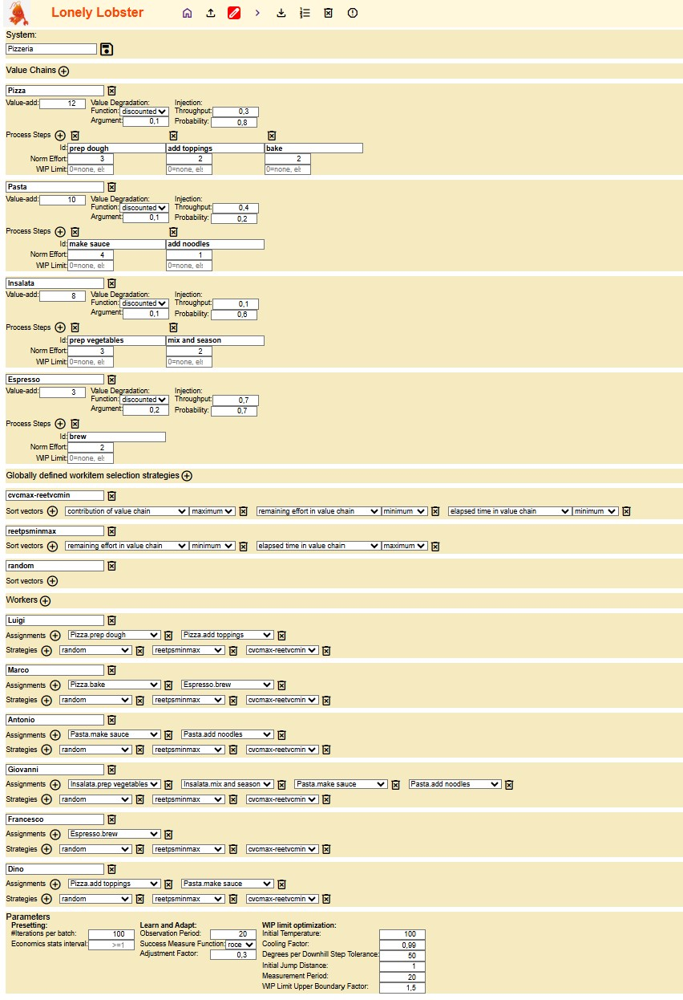
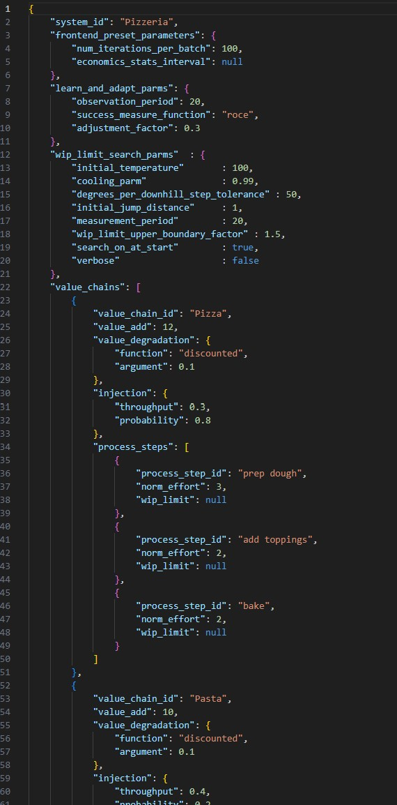

# Lean Manufacturing
Seit dem Beginn der Industrialisierung Ende des 18. Jahrhunderts hat die Produktion von Waren für nahezu alle Bereiche des Lebens stetig an Effizienz gewonnen. Die fabrikbasierte Massenproduktion hat die Menge und die Qualität der produzierten Waren kontinuierlich gesteigert und gleichzeitig die Stückkosten immer weiter reduziert. Unser heutiger materieller Wohlstand gründet auf ihr.

Was macht die Massenproduktion in Fabriken so effizient? Es sind u.a. 
* eine klar definierte, standardisierte Abfolge von Arbeitsstationen, die ein Werkstück durchläuft. In aller Regel ist dieser Ablauf linear, d.h. Werkstücke es ist eine Kette von Arbeitsstationen, die jeweils genau eine Vorgänger und einen Nachfolger haben. Ausnahmen sind die erste Arbeitsstation (hat keinen Vorgänger) und die letzte (hat keinen Nachfolger). Diese Abfolge von Arbeitsschritten wird oft als Wertschöpfungskette bezeichnet, da die Arbeit in jedem Schritt zum Wert des Werkstücks beiträgt.  
* in jeder Arbeitsstation werden nur wenige, aber spezialisierte Arbeitschritte am Werkstück ausgeführt. Dabei können auch (weitere) Rohmaterialen oder Zwischenprodukte anderer Wertschöpfungsketten einbezogen und mit dem Werkstück integriert und verarbeitet werden. 
* Sind alle Arbeiten einer Arbeitsstation abgeschlossen, wird das Werkstück an die nächste Arbeitsstation weitergegeben bzw. von dieser "abgeholt". Von der letzten Arbeitsstation wird das  Endprodukt dem Markt, Kunden bzw. Konsumenten übergeben.
* Um die speziellen Arbeitsschritte in einer   Arbeitstation ausführen zu können, sind ihr hierfür ausgebildete, auf die Arbeitsschritte spezialiserte Bearbeiter, die nötigen Materialen und meist unterstützende Maschinen zugewiesen. Die Arbeitsschritte werden nach einer für die Arbeitsstation vorgegebenen Methode ausgeführt. Messungen und daraus abgeleitete KPIs geben kontinuierlich Aufschluss z.B. über Effizienz, Qualität, Arbeitslast etc. Siehe [The 5Ms of Lean Manufacturing](https://theleansuite.com/the-5-ms-of-lean-manufacturing): Manpower, Material, Machines, Methods, Measurments.
* Stringente Einhaltung von Maßnahmen, die eine hohe Zuverlässigkeit und Qualität in jedem Arbeitsschritt sicherstellt, um Mehraufwand für die Behebung von vermeidbaren Verarbeitungsmängel und Ausschuss zu vermeiden.  Siehe z.B. [Six Sigma](https://de.wikipedia.org/wiki/Six_Sigma)
Die Organisation von effizienter Massenproduktion ist wissenschaftlich gut verstanden und viele abgeleitete Vorgehensweisen und bewährte Best Practices in den meisten Produktionsbetrieben auf der Welt fest etabliert. Der Überbegriff 
[Lean Manufacturung](https://en.wikipedia.org/wiki/Lean_manufacturing) fasst das Wissen über die Organisation effizienter Produktion zusammen.

# Vorteile des Lean Manufacturings: 
Ist eine Produktionsstraße, also die Einrichtungen in einer Fabrik, die die Wertschöpfungskette mittels Arbeitsstationen darstellt, nach Lean Manufactoring Prinzipien organsiert, entstehen eine Reihe von Vorteile:
* gute Nutzung der eingesetzten Ressourcen, also von Maschinen, Material, Menschen. Das Verhältnis von Kosten für die eingesetzten Resourcen zu den erzielten Verkaufserlösen für die entstandenen Endprodukte wird  verringert, m.a.W. pro Endprodukt sinken die Produktionskosten, was die Wettbewerbsfähigkeit des Herstellers steigert.
* Die Durchlaufzeiten durch die Wertschöpfungskette werden reduziert. Das hat mehrere positive Effekte:
    * Werden Produkte auf Bestellung produziert, dann kann so sichergestellt werden, dass die Wartezeit für den Besteller minimiert wird. Die Durchlaufzeit vom ersten Arbeitsschritt bis zur Übergabe an den Besteller wird minimiert. Auch kann besser vorhergesagt werden, wann das Endprodukt zur Lieferung bereitsteht. Vielen Besteller schätzen derlei zuverlässigen und schnelle Lieferung und sind bereit, hierfür mehr Geld auszugeben.
    * Je mehr Werkstücke gleichzeitig in unfertigem Zustand in der Wertschöpfungskette sich befinden, desto mehr Kapital wird gebunden. Für den Erwerb der  Rohmaterialien und die (variable) Bezahlung der Bearbeiter sind bereits Ausgaben angefallen, denen noch kein Verkaufserlös entgegensteht. Diese Kosten, das sogenannte Arbeitskapital, muss finanziert werden, z.B. als Darlehen einer Bank. Je höher also das Inventar in der Produktionskette, desto höher der Bedarf an Arbeitskapital, desto höher die Ausgaben für dessen Finanzierung, desto niedriger die erzielte Marge. (Marge ist die Differenz zwischen Verkaufserlös und den  enstandenen Kosten für die Herstellung des Endprodukts, in das anteilig auch die Finanzierungskosten für das Arbeitskapital einfließt.) Methoden des Lean Manufactorings helfen, die Durchlaufzeiten und das  Inventar an nicht fertigen Werkstücken in der Wertschöpfungskette zu minimieren. 
    * Die Minimierung des Inventars in der Wertschöpfungskette erhöht auch die Agilität, sich auf neue Nachfragesituationen einzustellen. Befinden sich zu jedem Zeitpunkt nur relativ wenige unfertige Werkstücke in Bearbeitung, kann schnell auf die Produktion anderer Produkte umgestellt werden, ohne dass erst eine große Zahl von unfertigen Werkstücken noch fertigzubauen sind. Diese träfen dann bei ihrer Fertigstellung möglicherweise auf einen nur noch wenig interessenten Markt und können nur noch mit größeren Preisnachlässen verkauft werden. Im Gegensatz hierzu hilft Lean Manufacturing, schnell mit neuen Produkten am Markt zu sein.
    * Es gibt immer wieder Situationen, in denen temporär mehr neue Aufträge hinzukommen als die Wertschöpfungskette abarbeiten kann. Es bildet sich ein Liste von Aufträgen, die auf Bearbeitung warten (Backlog). In Wertschöpfungsketten, die mit der Bearbeitung aller Aufträge sofort starten, führt dies zur Verstopfung der Wertschöpfungskette: es stauen sich unfertige Werkstücke vor überlasteten Arbeitsstationen mit negativen Effekten wie schlechterer Vorhersagbarkeit des Fertigstellungszeitpunkts und durchschnittliche längere Lieferzeiten. Sollte jetzt ein besonders wichtiger und lukrativer Auftrag hinzukommen, dem Priorität gegenüber anderen Aufträgen eingeräumt werden soll, ist es schwierig, diesen beschleunigt durch die verstopfte  Wertschöpfungskette zu bringen. So müssten die Arbeiten an Werkstücken anderer Aufträge in den Arbeitsstationen gestoppt werden, die Werkstücke beiseite gelegt und die Arbeit am neuen Werkstück aufgenommen werden. Anschließend sind die beiseite gelegten Werkstücke wieder in Bearbeitung zu nehmen. Das hat zusätzliche Rüstzeiten und damit weiteren Arbeitsaufwand zur Folge. Hinzu kommt, dass jede solche Abweichung vom normalen Ablauf das Risiko von Qualitätsproblemen und Produktionsstörungen erhöht, was ich wiederum auf Durchlaufzeiten und Kosten negativ auswirkt. Ist jedoch die Wertschöpfungskette nach Lean Manufactoring Prinzipien organisiert, wird der Start der Bearbeitung eines Auftrags solange zurückgehalten, bis gesichert ist, dass die Durchlaufzeit möglichst minimal ist. Es kann noch im Backlog - also bevor Arbeitsaufwand in den Auftrag geflossen ist - entschieden werden, welche noch nicht in Bearbeitung befindlichen Aufträge zugunsten des neuen Auftrags zurückgestellt werden und der neue Auftrag kann dann ohne weitere Eingriffe zügig durch die Wertschöpfungskette laufen.

Um die oben beschriebenen Vorteile von Lean Manufacturing zu realisieren, kommen verschiedene Praktiken zum Einsatz. Eine der wichtigsten ist die "Beschränkung von unfertiger Arbeit" ("Work in Progress Limits" oder kurz WIP Limits), siehe hierzu [Kanban und WIP Limits](https://en.wikipedia.org/wiki/Kanban_(development))

# Dienstleistungen
In modernen Volkswirtschaften ist über die letzten Dekaden der Anteil der Dienstleistungen an dem Bruttosozialprodukt weiter gestiegen, oft verbunden mit einem Rückgang der industriellen Fertigung. Somit nimmt diese Art der  Wertschöpfung in post-industriellen Gesellschaften eine wichtige Rolle zum Erhalt bzw. zur Steigerung des Wohlstands ein. Es liegt auf der Hand, dass wie in der industriellen Fertigung auch bei Büroarbeit nach hoher Effizienz und Qualität zu streben ist, um wettbewerbsfähig zu bleiben.

Bei der industriellen Produktion ist das Endprodukt ein physisches Gut, das hergestellt, gelagert, transportiert und verkauft werden kann (z. B. Autos, Maschinen, Kleidung). Bei Dienstleistungen hingegen ist der Output  immateriell und oft nicht lagerfähig (z. B. Beratung, Gesundheitsversorgung, Bildung). Dienstleistungen werden von Menschen für Kunden, Patienten, Bürger, etc. erbracht, oft individuell auf die Bedürfnisse des Empfängers angepasst. Im Gegensatz zur industriellen Fertigung spielt die Verarbeitung von Rohmaterialien und der Einsatz von Maschinen keine oder nur eine untergeordnete Rolle. Dennoch wirken viele Dienstleistungen auf die materielle Welt, z.B. auf einen Patienten, der von einem Arzt behandelt wird, auf eine Parkanlage, die von einem Gartenbauunternehmen umgestaltet wird oder die Reinigung eines Gebäudes.  

Manche Dienstleistungen sind immateriell, d.h. sie verarbeiten keine Rohmaterialien und wirken auch nicht auf die physische Welt ein. Immaterielle Dienstleistungen werden oft als Büroarbeit erledigt: die an der Wertschöpfung beteiligten Mitarbeiter nehmen Arbeitsaufträge entgegen, oft per digitaler Kanäle, und bearbeiten diese. Sie nutzen im Unternehmen gespeicherten Daten und beziehen in manchen Fällen auch extern verfügbare Informationen mit ein. Bei der Bearbeitung  kommen meist IT-Anwendungen zum Einsatz, zukünftig zunehmend auch KI-Systeme. Hat der Mitarbeiter seine Bearbeitung gemäß seiner Fähigkeiten und im Rahmen seiner Zuständigkeit abgeschlossen, geht das erzeugte immaterielle Ergebnis an den internen oder externen Auftraggeber.   
Auch bei Dienstleistungen und auch in der Büroarbeit werden häufig Wertschöpfungsketten durchlaufen, m.a.W. der immaterielle Auftrag durchläuft eine Kette von Arbeitsstationen, bevor das immaterielle Endergebnis dem Auftraggeber übergeben wird.   

# Wissensarbeit
Inbesondere bei Dienstleistungen, deren Erbringung hohe Ansprüche an die Bearbeiter z.B. hinsichtlich Analyse des zu bearbeitenden Sachverhalts, dessen Einschätzung, dem Erwägen von Handlungsoptionen, der Auswahl und Anwendung von Methoden stellen, erfordern ein hohes Maß an Ausbildung, Einarbeitung und Wissen, um den jeweils auszuführenden Auftrag bzw. einen erforderlichen Arbeitsschritt in der Wertschöpfungskette zügig und hoher Qualität ausführen zu können. Oft ist eine jahrelange - möglicherweise akademische - Ausbildung und eine lange Einarbeitungsphase erforderlich, in der sich der Mitarbeiter auf diese Art von Aufgabe spezialisiert.

# Unternehmen für komplexe, immaterielle, wissensbasierte Dienstleistungen
Das Streben nach Steigerung der wirtschaftlichen Produktivität geht einher mit einem wachsendem Bedarf an spezialisierter Wissensarbeit, z.B. in Form von
* Marktanalysen
* maßgeschneiderter Unternehmensfinanzierung
* Konzeption und Umsetzung von Projekten
* juristische Beratung 
* Aufbau und Betrieb von komplexen IT-Systemen
* die Entwicklung zugeschnittener Software-Anwendungen
* Suche und Gewinnung von qualifizierten Personal
* Verhandlung von individuellen Geschäftsverträgen
* Steuerberatung
* Vermögensverwaltung
* etc.

Auch Unternehmen, die derartige, mehr oder weniger standardisierte Dienstleistungen im Markt anbieten, müssen sich mit der internen Arbeitsorganisation beschäftigen, um zuverlässig und zeitgerecht hochqualitative Endergebnisse dem Auftraggeber liefern zu können. Es stellt sich die Frage, nach welchen Prinzipien ein Unternehmen diese Dienstleistungen organisieren kann und welche Prinzipien und Techniken des Lean Manufacturings sinnvoll übertragbar sind. 

Was zeichnet diese Art der Wertschöpfung aus und wie unterscheidet sie sich von der industriellen Produktion von Gütern?

Nachfolgende eine Aufstellung von Unterschieden:

| Nr.| Dimension | Industrielle Produktion | Wissensbasierte Dienstleistungen |
| :---: | --- | --- | --- |
| 1. | Bedeutung von (Roh-)Materialien | hoch | keine |
| 2. | Wertschöpfungsketten im Unternehmen | wenige, meist stark standardisiert | oft viele, eher mäßig standardisiert |
| 3. | Maßgebliche Kosten | Mitarbeiter, Maschinen (Energie, Wartung), Lagerhaltung, Logistik | Mitarbeiter, IT-Systeme |
| 4. | Stückzahlen in einer Wertschöpfungskette | meist hoch | geringer |
| 5. | Varianz des Arbeitsaufwands für ein Werkstück/Auftrag | niedrig | oft hoch |
| 6. | Transparenz über den Bearbeitungsstand einzelner Aufträge bzw. Werkstücke | hoch  | oft niedriger |
| 7. | Anteil der effektiven Bearbeitungszeit an der Gesamtdurchlaufzeit | hoch, oft über 80%, d.h. der Großteil der Durchlaufzeit ist das Werkstück in Bearbeitung  | selten höher als 20%; Zwischenergebnisse schlummern in E-Mail-Postfächern, Tasklisten oder besser in Workflow-Systemen |
| 8. | Zuweisung von Mitarbeitern zu Arbeitsstationen | i.d.R. exklusiv  | Spezialist oft in mehreren Arbeitsschritten in mglw. mehreren Wertschöpfungsketten tätig |

Es finden sich in der Literatur einige Arbeiten, die sich mit der Frage beschäftigen, in wie weit sich Techniken und Prinzipien des Lean Manufacturung auch in Firmen einsetzen lassen, die komplexe, immaterielle, wissensbasierte Dienstleistungen anbieten. Beispiel hierfür ist [Havard Business Review: Lean Knowledge Work
by Bradley R. Staats and David M. Upton 2021](https://hbr.org/2011/10/lean-knowledge-work). 
Diese Arbeiten beschäftigen sich mit der Anwendbarkeit der [Key Principles des Lean Managements](https://en.wikipedia.org/wiki/Lean_manufacturing), oft mit besonderem Fokus auf Continuous Improvement und People. 

# Ein spezielles Problem
In Unternehmen für komplexe, immaterielle, wissensbasierte Dienstleistungen ist oft ein Phänomen zu beobachten, das  bei Mitarbeitern, Managern und den Auftraggebern Verwunderung, wenn nicht gar Frustration und Ärger, hervorruft: Aufträge, die gestartet wurden und eine Wertschöpfungskette durchlaufen müssen, brauchen unverständlich lange, bis sie fertig gestellt werden und das obwohl Praktiken des Lean Manufacturings wie Flusskontrolle zur Anwendung kommen.

Neben Faktoren wie die Ausbildung und Fähigkeiten der Mitarbeiter, der Einsatz von unterstützender Technologie und einer im besten Falle etablierten Praxis, kontinuierlich an Verbesserungen im Process zu arbeiten, liegt einer der Ursachen in Engpässen, die durch Spezialisten im Unternehmen entstehen, deren (punktuelles) Mitwirken in mehreren Wertschöpfungsketten erforderlich ist. Aus Perspektive des Spezialisten kreuzen sich mehrere Wertschöpfungsketten auf seinem Tisch, der leider zu oft mit zu vielen Arbeitsaufträgen voll ist. Selbst wenn der Spezialist im Durchschnitt ausreichend Kapazität hat, um seinen notwendigen Beitrag in allen Wertschöpfungsketten zu leisten, so entstehen bei variierendem Auftragseingang schnell Überlastsituationen und damit Staus in einer oder mehreren Wertschöpfungsketten. 

Hier zeigt sich ein Unterschied zur klassischen industriellen Fertigung: in der Fertigung sind Ressourcen, also Mensch und Maschinen in den aller meisten Fällen exklusiv einem einzigen Arbeitsschritt zugeordnet. Es bestehen damit durch die Ressourcen keine Abhängigkeiten zwischen Wertschöpfungsketten. Wertschöpfungsketten können unabhängig voneinander optimiert werden, z.B. gemäß der Methoden des Lean Managements. Anders in Unternehmen, die Wissensarbeit verrichten und die Spezialisten über mehrere Wertschöpfungsketten einsetzen müssen. Besonders häufig wird dieses Phänomen bei Unternehmen zu Tage treten, in denen 
* anspruchsvolle Aufträge in unterschiedlichen Weertschöpfungsketten bearbeitet werden und 
* in denen zumindest in einigen Arbeitschritten die  Expertise von hochspezialsierten Mitarbeitern erforderlich ist und
* die eine Unternehmensgröße haben, die nicht erlaubt, eine Personaldecke vorzuhalten, in denen ausreichend Spezialisten mit der erforderlichen Expertise jeder Wertschöpfungskette  jeweils exklusiv zugewiesen werden können. 

Mit anderen Worten, dieses Phänomen dürfte besonders kleinere oder mittelständische Unternehmen betreffen. 

Beispiele für Spezialisten, die häufig den Spagat zwischen verschiedenen Wertschöfungsketten machen müssen:

| Nr.| Spezialist aus Bereich | Beitrag in Wertschöpfungsketten (einige Beispiele)|
| :---: | --- | --- |
| 1. | Rechtsabteilung |  Vertrieb: unterstützt bei der Gestaltung von Angeboten |
||| Reklamationen: unterstützt bei schwerigen Reklamationsfällen und Rechtsstretigkeiten mit anderen Unternehmen |
||| Lieferantenverträge: beurteilt kommerzielle Bedingungen von Lieferanten |
| 2. | Rechnungswesen | Anlegen neuer Aufträge im Rechnungswesen |
|  |  | Jahresabschluss: Erstellen der Bilanz  |
|  |  | Stundungen von Forderungen: Anpassungen der Zahlungspläne   |
| 3. | Personal | im Recruiting: Beurteilung von Kandidaten |
|  |  | im Recruiting: Erstellen von Stellenangeboten und Publikation in geeigneten Social Media-Kanälen  |
|  |  | in der Nachwuchsarbeit: Teilnahme an Talentmessen 
| 4. | IT-Administration | Im Betrieb: Systeme und Anwendungen überwachen und im Bedarfsfalle  reagieren |
|  |  | Bei Projekten: Infrastruktur für neue Anwendung konzipieren und realisieren |
|  |  | Planung: Budgetbedarf für Betrieb, Wartung und ggf. Erneuerung von Systemen abschätzen  |
| 5. | Kontrollfunktionen / Compliance  | bei Einführung neuer Systeme / Anwendungen: Datenschutzprüfung |
|  |  | bei Einführung neuer Systeme / Anwendungen: IT-Sicherheit bewerten und Maßnahmen mit IT erarbeiten |
|  |  | bei Einführung und Betrieb von Anwendungen: regulatorische Compliance sicherstellen |
| ... | ... | ... 
| 

# Lonely Lobster
Das Software-Projekt "Lonely Lobster" hat zum Ziel, die grundlegenden Effekte und Wirkungszusammenhänge in solchen Unternehmen systemtisch erforschen zu können. Die Lonely-Lobster-Anwendung bietet die Möglichkeit, idealisiert und von vielen Details des realen Unternehmensalltags abstrahierend Systeme mit mehreren Wertschöpfungsketten, jeweils mit mehreren Arbeitsschritten ausgestattet, zu definieren, Mitarbeiter einem oder mehreren Arbeitschritten  zuzuordnen und den Zufluss neuer Arbeitsaufträge zu steuern. Lonely-Lobster simuliert die Abarbeitung der (immteriellen) Werkstücke und visualisiert diese. Statistiken und KPIs werden errechnet und dargestellt, um die Effizenz des Systems bewerten zu können. Es erlaubt insbesondere u.a folgenden Fragen nachzugehen:
1. Wie soll der Zufluss an neuen Arbeitsaufträgen in das System und in einzelne Arbeitsstationen gesteuert werden, um ein bestmögliches Ergebnis für das Unternehmen zu erzielen?
1. Wie soll sich der einzelner Mitarbeiter verhalten, wenn sie oder er mehrere unfertige Werkstücke zur Bearbeitung vorliegen hat. Welches Werkstück soll sie oder er auswählen, um es als nächstes (weiter) zu bearbeiten?
1. Insbesondere, wie soll sie oder er die Auswahl treffen, wenn die Werkstücke aus verschiedenen Arbeitsschritten von mglw. unterschiedlichen Wertschöpfungsketten zur Bearbeitung vorliegen? 
1. Welche Effekte auf die Effizienz des Gesamtsystems haben verschiedene Auswahlstrategien?     

## Terminologie
Im Weiteren werden nachfolgenden Begriffe verwendet:
| Begriff | Definition | Synonyme |
| :--- | :--- | :--- |
| Worker | ein oder eine Mitarbeiterin | Bearbeiter(in) |
| Work Item | Werkstück | |
| Inventory | eine Sammlung von (noch nicht fertigen) Work Items |  |
| Output Basket | ist das Inventory aller End Products |  |
| Process Step | Arbeitsstation, in der die zugewiesenen Workers die notwendige Arbeit an Work Items im Inventory des Process Step verrichten, bis sie zum nächste Process Step oder schließlich zum Output Basket weitergegeben werden können  | Arbeitsstation |
| Value Chain | Wertschöpfungskette, bestehend aus mindest einem Process Step | Produktionslinie |
| System | Lauffähiges Gesamtsysten, das aus mindestens 1 Value Chain und 1 Worker besteht; ein System hat darüberhinaus noch weitere Einstellmöglichkeiten (Parameter) |  |
| Configuration | Definition eines Systems mit seinen Value Chains, Workers, Strategies, System Parameters; kann als JSON-File in das Lonely-Lobster-Frontend hochgeladen oder nach Erstellung bzw. Änderung in das lokale Download-Verzeichnis exportiert werden; Configurations können im Lonely Lobster Editor erstellt und überarbeitet werden  |  |
| Editor | ist eine Funktion im Frontend, um Configurations zu erstellen bzw. zu bearbeiten |  |
| Work Order | ein Work Item, das in einer Value Chain in den ersten Process Step eintritt | Arbeitsauftrag, Auftrag |
| End Product | ein Work Item, dessen Bearbeitung in seiner Value Chain komplett abgeschlossen und den Output Basket übergeben wurde |  |
| Time Unit | Zeitabschnitt: die Zeit in Lonely-Lobster vergeht in diskreten Schritten. Die Zeit startet bei 0 und wird bei jeder Iteration inkrementiert | Time |
| Iteration | Aus dem aktuellen State wird der nächste errechnet, dabei schreitet die Zeit um eine Time Unit voran. |  |
| Effort | Aufwand, d.h. die Anzahl von Zeiteinheiten, die Worker für ein Work Item aufgewandt haben. Worker können 0 oder 1 Effort-Einheit pro Time Unit an einem Work Item arbeiten  |  |
| Norm Effort | Aufwand für die nötige Arbeit, die Worker an einem Work Item in einem Process Step leisten müssen, um es zur nächsten Arbeitsstation oder dem Output Basket weiterreichen zu können  |  |
| Utilization | Be-/Auslastung eines Workers über das Interval. Utilization errechnet sich als Anteil der TimeUnits in einem Interval, in der der Worker an Workitems gearbeitet hat. Ist der Anteil kleiner 50% wird der Name in hellgrün angezeigt, bis 80% grün, bis 90% orange, darüber rot |  |
| Value | der Erlös, den das End Product beim Kunden oder am Markt erzielt. Da in Lonely-Lobster von immaterieller Wissensarbeit ausgegangen wird und der Erwerb von Rohmaterial nicht erforderlich ist, entspricht der Value gleichzeitig dem Mehrwert  | Value-add |
| Cost | Kosten für den geleisteten Effort, falls die Worker-Kosten variabel sind, d.h. die Worker werden nur vergütet, wenn sie an einem Work Item arbeiten. Damit entspricht Cost der Summe des geleisteten Efforts bzw. bei Ankunft im Output Basket der Summe aller Norm Efforts der Process Steps in der Value Chain. Bei fixen Worker-Kosten, d.h. einem Bestand von Festangestellten, entstehen die Kosten durch die vergehende Zeit, unabhängig davon, wie oft der Worker an Work Items gearbeitet hat. Amerkung: Effort und Value haben in Lonely-Lobster dieselbe Maßeinheit |  |
| Strategy | Strategie, nach der Worker in der aktuellen Time Unit eines von mehreren Work Items, die ihr oder ihm vorliegen, zur Bearbeitung auswählt. | Langform: Work Item Selecton Strategy |
| WIP Limit | Die maximale zulässige Anzahl an Work Items in einem Process Step. Hierzu werden auch im Process Step fertigestellte Work Items gezählt. Anmerkung: der Wert 0 bedeutet in Lonely Lobster, dass **kein** Limit gesetzt ist  | Work in Progress Limit |
| Cycle Time | Durchlaufzeit eines Work Items, gemessen vom Eintritt in eine Value Chain oder in einen Process Step, bis zu dessen Verlassen |  |
| Elapsed Time | bisher vergangene Zeit, seitdem ein Work Item in seine Value Chain oder Process Step eingetreten ist |  |
| Discounted Value  | reduzierter Wert, der beim Kunden oder am Markt erzielt werden kann. Der Wert mag sich verändern, je länger der Kunde oder der Markt auf die Lieferung warten muss. In Lonely-Lobster kann eingestellt werden, wie der Wert sich verändert abhängig von der Cycle Time eines End Products: maßgeblich ist die Zeit, die über die minimale Cycle Time, d.h. den Effort der Value Chain, hinausgeht |  |
| Contribution Margin | Die Differenz zwischen dem für ein End Product erlösten (discounted) Werts und dem Effort  |  |
| Interval | Zeitspanne zurück in die Vergangenheit gemessen in Time Units. Ein Wert von 0 bedeutet von Anfang, also Time 0, an  | Observation Period |
| Throughput | Anzahl von Work Items, die in einem Interval pro Time Unit in einem Process Step abgeschlossen wurden bzw. den Output Basket erreicht haben (i.e. Troughput in Items "TPI"). Der Durchsatz kann auch anhand des Wertes gemessen werden (i.e. Troughput in Value "TPV"). TPV berücksichtigt  nicht Stücke sondern den Value  |  |
| ROCE | Return On Capital Engaged: die zu einem Zeitpunkt kummulierte Cost im System für alle Work Items, die noch kein End Product sind, m.a.W. die noch in ihrer Value Chain in Bearbeitung sind. "ROCE fix" wird auf Basis einer fixen Belegschaft berechnet, "ROCE var" auf der Annahme, dass nur erbrachte Arbeit an Work Items vergütet wird  |  |
| Frontend | Der Teil von Lonely-Lobster, der im Browser des Users läuft  |  |
| Backend | Der Teil von Lonely-Lobster, der in der Cloud läuft und ein System, wie es durch die aktuelle Configuration im Browser definiert ist, ausführen kann |  |

## The User Interface
Hier das User Interface von Lonely Lobster mit einer beispielhaften Configuration, das als System ausgeführt werden kann:

Nachfolgend wird auf die einzelnen Sektionen des User Interface eingegangen.

### Application Control Bar

| Label | Erläuterung | Details |
| :---: | :--- | :--- |
| 1 | Hier finden sich 8 Symbole. Von links nach rechts:  | <svg xmlns="http://www.w3.org/2000/svg" height="24px" viewBox="0 -960 960 960" width="24px" fill="#5f6368"><path d="M240-200h120v-240h240v240h120v-360L480-740 240-560v360Zm-80 80v-480l320-240 320 240v480H520v-240h-80v240H160Zm320-350Z"/></svg> __Home__: zeigt einige Informationen über Lonely-Lobster |
|   |   | <svg xmlns="http://www.w3.org/2000/svg" height="24px" viewBox="0 -960 960 960" width="24px" fill="#5f6368"><path d="M440-320v-326L336-542l-56-58 200-200 200 200-56 58-104-104v326h-80ZM240-160q-33 0-56.5-23.5T160-240v-120h80v120h480v-120h80v120q0 33-23.5 56.5T720-160H240Z"/></svg> __Upload__: eine JSON-Datei mit einer Configuration in das Lonely-Lobster-Frontend hochladen |
|   |   | <svg xmlns="http://www.w3.org/2000/svg" height="24px" viewBox="0 -960 960 960" width="24px" fill="#5f6368"><path d="M200-200h57l391-391-57-57-391 391v57Zm-80 80v-170l528-527q12-11 26.5-17t30.5-6q16 0 31 6t26 18l55 56q12 11 17.5 26t5.5 30q0 16-5.5 30.5T817-647L290-120H120Zm640-584-56-56 56 56Zm-141 85-28-29 57 57-29-28Z"/></svg> __Edit__: eine Configuration erstellen und editieren |
|   |   | <svg xmlns="http://www.w3.org/2000/svg" height="24px" viewBox="0 -960 960 960" width="24px" fill="#5f6368"><path d="M504-480 320-664l56-56 240 240-240 240-56-56 184-184Z"/></svg> __Run__: aktuelle Configuration in das Lonely-Lobster-Backend laden und als System ausgeführen; Ausführen erfordert zuvor einen Login, s.u. |
|   |   | <svg xmlns="http://www.w3.org/2000/svg" height="24px" viewBox="0 -960 960 960" width="24px" fill="#5f6368"><path d="M480-320 280-520l56-58 104 104v-326h80v326l104-104 56 58-200 200ZM240-160q-33 0-56.5-23.5T160-240v-120h80v120h480v-120h80v120q0 33-23.5 56.5T720-160H240Z"/></svg> __Download__: eine Configuration in den  Download-Folder auf dem lokalen Rechner herunterladen  |
|   |   | <svg xmlns="http://www.w3.org/2000/svg" height="24px" viewBox="0 -960 960 960" width="24px" fill="#5f6368"><path d="M120-80v-60h100v-30h-60v-60h60v-30H120v-60h120q17 0 28.5 11.5T280-280v40q0 17-11.5 28.5T240-200q17 0 28.5 11.5T280-160v40q0 17-11.5 28.5T240-80H120Zm0-280v-110q0-17 11.5-28.5T160-510h60v-30H120v-60h120q17 0 28.5 11.5T280-560v70q0 17-11.5 28.5T240-450h-60v30h100v60H120Zm60-280v-180h-60v-60h120v240h-60Zm180 440v-80h480v80H360Zm0-240v-80h480v80H360Zm0-240v-80h480v80H360Z"/></svg> __Events Export__: die Einzel-Events eines ausgeführten Systems als CSV-Datei in den  Download-Folder auf dem lokalen Rechner herunterladen; mit diese Daten können mit Statistics-Tools weitergehende statistische Auswertungen gemacht werden |
|   |   | <svg xmlns="http://www.w3.org/2000/svg" height="24px" viewBox="0 -960 960 960" width="24px" fill="#5f6368"><path d="m376-300 104-104 104 104 56-56-104-104 104-104-56-56-104 104-104-104-56 56 104 104-104 104 56 56Zm-96 180q-33 0-56.5-23.5T200-200v-520h-40v-80h200v-40h240v40h200v80h-40v520q0 33-23.5 56.5T680-120H280Zm400-600H280v520h400v-520Zm-400 0v520-520Z"/></svg> __Drop__: die aktuelle Configuration wird verworfen |
|   |   | <svg xmlns="http://www.w3.org/2000/svg" height="24px" viewBox="0 -960 960 960" width="24px" fill="#5f6368"><path d="M480-280q17 0 28.5-11.5T520-320q0-17-11.5-28.5T480-360q-17 0-28.5 11.5T440-320q0 17 11.5 28.5T480-280Zm-40-160h80v-240h-80v240ZM330-120 120-330v-300l210-210h300l210 210v300L630-120H330Zm34-80h232l164-164v-232L596-760H364L200-596v232l164 164Zm116-280Z"/></svg> <svg xmlns="http://www.w3.org/2000/svg" height="24px" viewBox="0 -960 960 960" width="24px" fill="#5f6368"><path d="m792-282-58-56 26-26v-232L596-760H364l-26 26-56-58 48-48h300l210 210v298l-48 50ZM520-552v-128h-80v48l80 80ZM820-28 678-170l-48 50H330L120-332v-298l48-48L28-820l56-56L876-84l-56 56ZM536-536ZM364-200h232l26-26-396-396-26 26v232l164 164Zm116-80q-17 0-28.5-11.5T440-320q0-17 11.5-28.5T480-360q17 0 28.5 11.5T520-320q0 17-11.5 28.5T480-280Zm-56-144Z"/></svg>  __Activity Log__: zeigt die Aktivitäten der Lonely-Lobster Anwendung, u.a. Warnings, Errors; die Anzeige der Liste der Aktivitätenmeldungen kann toggled werden |
| 2 | Zentrale Informationen :  | Frontend Software Version |
|   |  | Systemnamen der aktuellen Configuration |
|   |  | Events aus dem Lonely-Lobster Anwendungs-Activity Log  |
| 3 | <svg xmlns="http://www.w3.org/2000/svg" height="24px" viewBox="0 -960 960 960" width="24px" fill="#5f6368"><path d="M480-120v-80h280v-560H480v-80h280q33 0 56.5 23.5T840-760v560q0 33-23.5 56.5T760-120H480Zm-80-160-55-58 102-102H120v-80h327L345-622l55-58 200 200-200 200Z"/></svg> Log in, <svg xmlns="http://www.w3.org/2000/svg" height="24px" viewBox="0 -960 960 960" width="24px" fill="#5f6368"><path d="M200-120q-33 0-56.5-23.5T120-200v-560q0-33 23.5-56.5T200-840h280v80H200v560h280v80H200Zm440-160-55-58 102-102H360v-80h327L585-622l55-58 200 200-200 200Z"/></svg> Log out:  | soll eine Configuration (im Backend) ausgeführt werden, muss der User sich zuerst einloggen; ist der User eingeloggt, wird sein Namen angezeigt  |

### System Control Bar
Ist eine Configuration ins Backend geladen worden, so dass das definierte System ausgeführt werden kann, kann es über die System Control Bar gesteuert werden.

| Label | Erläuterung |
| :---: | :--- | 
| 4 |  |
|   | Software-Version des Backends |
|   | Aktuelle Time (Unit) des Systems |
|   | Anzahl der Iterationen, die beim nächsten Click des Buttons "Run" ausgeführt werden sollen |
|   | __Run__: führt die nächste(n) Iterationen(en) aus |
|   | __Stop__: hält bei Ausführung von mehreren Iterationenen das System an |
|   | __Resume__: führt eine zuvor angehaltene Ausführung von mehreren Iterationenen wieder fort
|   | __Reset__: setzt das System wieder zurück in den Ausgangszustand, also vor der ersten Iteration |
|  5 |  Dieser Abschnitt zeigt die Worker mit folgenden jeweiligen Informationen: |
|    | __Utilization__: prozentuale Be-/Auslastung mit entsprechend eingefärbtem Namen |
|    | __Weighted Strategies__: die Farben zeigen an, welche Strategien der Worker zur Auswahl hat. Die relative Länge der Farbbalken zeigt, wie stark der Worker aktuell die einzelnen Strategien gewichtet, um ein bestmögliches Systemergebnis zu erzielen  |
|    | __Assignments__: Process Steps, denen der Worker zugewiesen ist |
|    | __Legende__: Legende der Strategien mit Namen und zugewiesenen Farben
| 6 |  |
|   | __Interval__: Interval, über das die Werte errechnet werden. Ein Wert von 0 bedeutet von Time 0 an bis jetzt |
|   | __Timestamp of Stats__: TimeUnit, bei der die Statistiken zuletzt berechnet wurden |
|   | __#End Products__: Anzahl der Workitems, die im Interval fertiggestellt wurden, m.a.W. die den Output Basket erreicht haben |
|   | __Avg.Cycle Time__: durchschnittliche Cycle Time der End Products durch die Value Chains |
|   | __Avg. Contribution Margin__: durchschnittliche Contribution, ggf. discounted  |
|   | __Avg. Working Capital__: durchschnittliches Working Capital |
|   | __ROCE var/fix__: Return on Capital Engaged für variable bzw. fixe Bezahlung der Worker |
| 7  |  |
|   |  __update view every iterstion__: das Frontend zeigt den Stand jeder Iteration |
|   | __show inventories__: das Frontend zeigt die Inventories. Ist der Toggle off, muss das Frontend nicht die  Inventories darstellen und die Iterationen laufen schneller  |
|   | __optimize WIP limits__: wenn toogle on, dann versucht Lonely-Lobster nach einem heuristischen Verfahren WIP limits zu finden, den ROCE des Systems zu maximieren. Der Toogle geht auf off, sobald das Backend (scheinbar) ein Optimum gefunden hat |

### Value Chains
...

...

...

...

...

...

...
...

