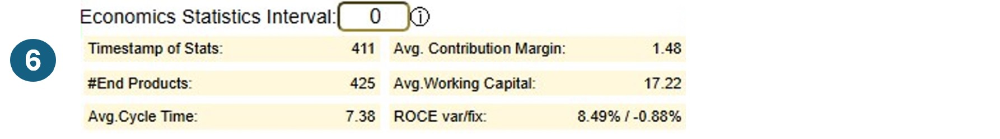
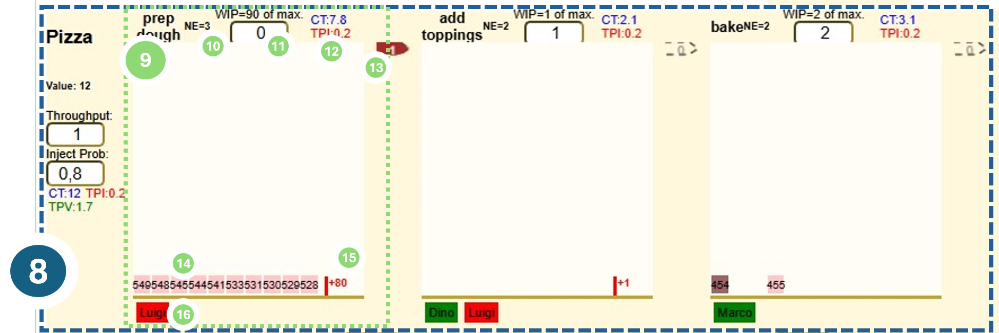
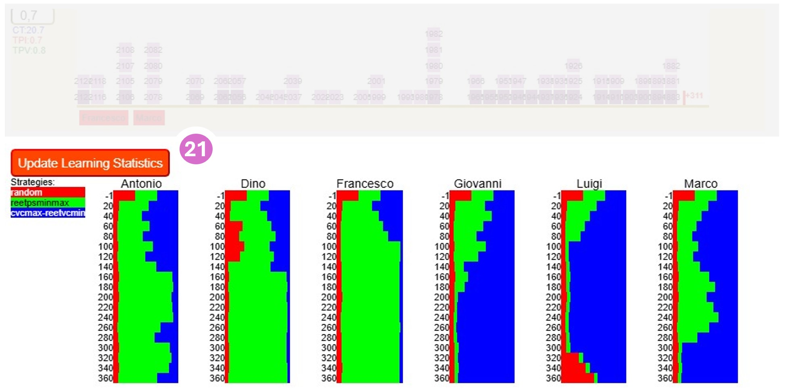

# Lean Manufacturing
Since the beginning of industrialization at the end of the 18th century, the production of goods for almost all areas of life has steadily increased in efficiency. Factory-based mass production has continuously increased the quantity and quality of the goods produced and at the same time reduced unit costs. Our material prosperity today is based on it.

What makes mass production in factories so efficient? Among other things, 
* A clearly defined, standardized sequence of work stations through which a workpiece passes. As a rule, this sequence is linear, i.e. workpieces pass through a chain of work stations, each of which has exactly one predecessor and one successor. Exceptions are the first work station (has no predecessor) and the last (has no successor). This sequence of work steps is often referred to as a value chain, as the work in each step contributes to the value of the workpiece.  
* In each workstation, only a few specialized work steps are carried out on the workpiece. In the process, (further) raw materials or intermediate products from other value chains can also be included and integrated and processed with the workpiece. 
* Once all the work at a workstation has been completed, the workpiece is passed on to the next workstation or “picked up” from it. From the last workstation, the end product is handed over to the market, customer or consumer.
* In order to be able to carry out the specific work steps in a work station, it is assigned trained workers, who are specialized in the work steps, the necessary materials and usually supporting machines. The work steps are carried out according to a method specified for the workstation. Measurements and the KPIs derived from them provide continuous information, e.g. on efficiency, quality, workload, etc. See [The 5Ms of Lean Manufacturing](https://theleansuite.com/the-5-ms-of-lean-manufacturing): Manpower, Material, Machines, Methods, Measurments.
* Strict adherence to measures that ensure high reliability and quality in every work step in order to avoid additional costs for the elimination of avoidable processing defects and rejects.  See e.g. [Six Sigma](https://de.wikipedia.org/wiki/Six_Sigma).
The organization of efficient mass production is scientifically well understood and many derived procedures and proven best practices are now well established in most manufacturing operations around the world. The umbrella term 
[Lean Manufacturing](https://en.wikipedia.org/wiki/Lean_manufacturing) summarizes the knowledge about the organization of efficient production.

# Advantages of lean manufacturing: 
If a production line, i.e. the facilities in a factory that represent the value chain by means of work stations, is organized according to lean manufacturing principles, a number of advantages arise:
* Good utilization of the resources used, i.e. machines, materials, people. The ratio of the costs of the resources used to the sales revenue generated by the end products produced is reduced, i.e. the production costs per end product are reduced, which increases the manufacturer's competitiveness.
* Lead times through the value chain are brought to a minimum. This has several positive effects:
    * If products are produced to order, then it can be ensured that the waiting time for the purchaser is minimized. The lead time from the first work step to handover to the customer is minimized. It is also easier to predict when the end product will be ready for delivery. Many customers appreciate such fast and reliable delivery and are prepared to pay more for it.
    * The more workpieces are in the value chain in an unfinished state at the same time, the more capital is tied up. Expenditure has already been incurred for the purchase of raw materials and the (variable) payment of workers, which is not yet offset by sales revenue. This expenditure, the so-called working capital, must be financed, e.g. by a loan from a bank. The higher the inventory in the production chain, the higher the need for working capital, the higher the expenses for its financing, the lower the margin achieved. The margin is the difference between the sales revenue and the costs incurred to manufacture the end product, which also includes the financing costs for the working capital on a pro rata basis. Lean manufacturing methods help to minimize lead times and the inventory of unfinished workpieces in the value chain. 
    * Minimizing inventory in the value chain also increases the agility to adapt to new demand situations. If there are only a relatively small number of unfinished workpieces being processed at any given time, it is possible to quickly switch to the production of other products without having to complete a large number of unfinished workpieces first. Upon completion, these workpieces may then find a market with little interest and can only be sold at a large discount. In contrast, lean manufacturing helps to bring new products to market quickly.
    * There are always situations in which there are temporarily more new orders than the value chain can process. A queue of orders (backlog) forms, waiting to be processed. In value chains that start processing all orders immediately, this leads to congestion in the value chain: unfinished workpieces pile up in front of overloaded workstations with negative effects such as poorer predictability of the completion time and longer average lead  times. If a particularly important and lucrative order comes along that should be given priority over other orders, it is difficult to speed it through the congested value chain. Work on workpieces from other orders in the work stations would have to be stopped, the workpieces put aside and work on the new workpiece started. Work on the workpieces that had been set aside would then have to resume again. This results in additional set-up times and therefore more work. In addition, any such deviation from the normal process increases the risk of quality problems and production disruptions, which in turn has a negative impact on throughput times and costs. However, if the value chain is organized according to lean manufacturing principles, the start of processing an order is held back until it is certain that the throughput time is as short as possible. A decision can be made in the backlog - i.e. before any work has gone into the order - as to which orders that are not yet being processed can be postponed in favor of the new order and the new order can then move quickly through the value chain without further intervention.

Various practices are used to realize the benefits of lean manufacturing described above. One of the most important is the “limitation of unfinished work” (“Work in Progress Limits” or WIP Limits for short) and the pull principle, see [Kanban and WIP Limits](https://en.wikipedia.org/wiki/Kanban_(development)).

# Services
In modern economies, the share of services in gross national product has continued to rise over the last few decades, often in conjunction with a decline in industrial production. This type of value creation therefore plays an important role in maintaining or increasing prosperity in post-industrial societies. It is obvious that, as in industrial production, services must also strive for high efficiency and quality in order to remain competitive.

In industrial production, the end product is a physical good that can be manufactured, stored, transported and sold (e.g. cars, machines, clothing). In services, on the other hand, the output is immaterial and often cannot be stored (e.g. consulting, healthcare, education). Services are provided by people for customers, patients, citizens, etc., often individually adapted to the needs of the recipient. In contrast to industrial production, the processing of raw materials and the use of machines play no or only a subordinate role. Nevertheless, many services have an impact on the material world, e.g. a patient being treated by a doctor, a park being landscaped by a gardening company or the cleaning of a building.  

Some services are intangible, i.e. they do not process raw materials and do not affect the physical world. Intangible services are often performed as office work: the employees involved in value creation receive work orders, often via digital channels, and process them. They use data stored in the company and in some cases also include externally available information. IT applications are usually used for processing, and AI systems will increasingly be used in the future. Once the employee has completed their work according to their skills and within the scope of their responsibilities, the intangible result generated is sent to the internal or external client.   
Value chains are also frequently used in services and office work, i.e. the immaterial order passes through a chain of workstations before the immaterial end result is handed over to the client.   

# Knowledge work
Particularly in the case of services, of which the provision places high demands on the employees, e.g. in terms of analyzing the facts, assessing them, considering options for action, selecting and applying methods, a high level of training, experience and knowledge is required in order to be able to carry out the necessary steps in the value chain quickly and to a high quality standard. It often takes years of training - possibly academic - and a long induction phase in which the employee specializes in this type of task.

# Company for complex, immaterial, knowledge-based services
The drive to increase economic productivity goes hand in hand with a growing need for specialized knowledge work, e.g. in the form of
* market analysis
* customized corporate financing
* conception and implementation of projects
* legal advice 
* development and operation of complex IT systems
* the development of customized software applications
* search for and recruitment of qualified personnel
* negotiation of individual business contracts
* tax advice
* asset management
* etc.

Companies that offer such more or less standardized services on the market must - like industrial companies - concern themselves with the internal organization of work in order to be able to deliver high-quality end results to the client reliably and on time. The question arises as to which principles a company can use to organize these services and which principles and techniques of lean manufacturing can be usefully transferred into the field of knowledge work. 

What characterizes this type of value creation and how does it differ from the industrial production of goods?

The following is a list of differences:

| No.| Dimension | Industrial production | Knowledge-based services |
| :---: | :--- | :--- | :--- |
| 1. | Importance of (raw) materials | high | none |
| 2. | Value chains in the company | few, mostly highly standardized | often many, rather moderately standardized |
| 3. | significant costs | material, employees, machines (energy, maintenance), warehousing, logistics | employees, IT systems |
| 4. | quantities in a value chain | mostly high | low |
| 5. | variance of work effort for workpieces | low | often high |
| 6. | transparency of the processing status of individual orders or workpieces | high | often lower |
| 7. | Effective processing time as a proportion of total processing time | high, often over 80%, i.e. the workpiece is being worked on for the majority of time | rarely higher than 20%; interim results remain often dormant in e-mail inboxes, task lists or, better, in workflow systems |
| 8. | assignment of employees to workstations | usually exclusive | often shared: specialist often active in several work steps in possibly several value chains |

There are several studies in the literature that deal with the question of the extent to which lean manufacturing techniques and principles can also be used in companies that offer complex, intangible, knowledge-based services. An example of this is [Havard Business Review: Lean Knowledge Work
by Bradley R. Staats and David M. Upton 2021](https://hbr.org/2011/10/lean-knowledge-work). 
These works deal with the applicability of the [Key Principles of Lean Management](https://en.wikipedia.org/wiki/Lean_manufacturing), often with a particular focus on continuous improvement and the employees. 

# A special problem
In companies providing complex, intangible, knowledge-based services, we observe often a phenomenon that causes surprise, if not frustration and anger, among employees, managers and clients: orders that have been started and have to pass through a value chain take an incomprehensibly long time to be completed, even though lean manufacturing practices are applied.

In addition to factors such as the training and skills of employees, the use of supporting technology and, in the best case, the application of continuous improvements, one of the causes lies in bottlenecks caused by specialists in the company whose (selective) involvement is required in several value chains. From the specialist's perspective, several value chains intersect on his desk, which is unfortunately too often full with too many workpieces. Even if the specialist has sufficient capacity on average to make the necessary contribution in all value chains, overload situations and thus congestion in one or more value chains quickly arise as the volume of incoming orders varies. 

This shows a difference to traditional industrial manufacturing: in manufacturing, resources, i.e. people and machines, are in most cases assigned exclusively to a single work step in a value chain. This means that there are no dependencies between value chains due to the resources. Value chains can be optimized independently of each other. The situation is different in companies that perform knowledge work and have to deploy specialists across several value chains. This phenomenon is particularly common in companies where 
* demanding orders are processed in different value chains and 
* in which the expertise of highly specialized employees is required in at least some work steps and
* whose company size does not allow them to maintain a staffing level in which sufficient specialists with the required expertise can be assigned exclusively to each value chain. 

In other words, this phenomenon is likely to affect smaller or medium-sized companies in particular. 

Examples of specialists who often have to perform the balancing act between different value chains:

| No.| Department | Contribution in value chains (some examples)|
| :---: | :--- | :--- |
| 1.| Legal department | Sales: supports in the design of offers |
| | | Complaints: assists with serious complaints and legal disputes with other companies |
| | | Supplier contracts: assesses commercial terms and conditions of suppliers |
| 2.| Accounting | Creating new orders in accounting |
| | | Annual financial statements: preparing the balance sheet |
| | | Deferrals of receivables: Adjustments to payment plans |
| 3.| HR | Recruiting: Assessing candidates |
| | | Recruiting: Creating job vacancies and publishing them on suitable social media channels |
| | | Recruiting: participation in job fairs |
| 4.| IT administration | Operations: monitoring systems and applications and take action when necessary |
| | | Projects: Designing and implementing infrastructure for new applications |
| | | Planning: Estimating budget requirements for operation, maintenance and, if necessary, renewal of systems |
| 5.| Control functions / compliance | Introduction of new systems / applications: Data protection check |
| | | Introduction of new systems / applications: Assess IT security and develop measures with IT |
| | | Introduction and operation of applications: ensuring regulatory compliance |

<####### Translation Marker #########>

# Lonely Lobster
Das Software-Projekt "Lonely Lobster" hat zum Ziel, die grundlegenden Effekte und Wirkungszusammenhänge in solchen Unternehmen systemtisch erforschen zu können. Die Lonely-Lobster-Anwendung bietet die Möglichkeit, idealisiert und von vielen Details des realen Unternehmensalltags abstrahierend Systeme mit mehreren Wertschöpfungsketten, jeweils mit mehreren Arbeitsschritten ausgestattet, zu definieren, Mitarbeiter einem oder mehreren Arbeitschritten  zuzuordnen und den Zufluss neuer Arbeitsaufträge zu steuern. Lonely-Lobster simuliert die Abarbeitung der (immteriellen) Werkstücke und visualisiert diese. Statistiken und KPIs werden errechnet und dargestellt, um die Effizenz des Systems bewerten zu können. Es erlaubt insbesondere u.a folgenden Fragen nachzugehen:
* Wie soll der Zufluss an neuen Arbeitsaufträgen in das System und in einzelne Arbeitsstationen gesteuert werden, um ein bestmögliches Ergebnis für das Unternehmen zu erzielen?
* Wie soll sich der einzelner Mitarbeiter verhalten, wenn sie oder er mehrere unfertige Werkstücke zur Bearbeitung vorliegen hat. Welches Werkstück soll sie oder er für die Bearbeitung als nächstes auswählen?  
* Insbesondere, wie soll sie oder er die Auswahl treffen, wenn die Werkstücke aus verschiedenen Arbeitsschritten von mglw. unterschiedlichen Wertschöpfungsketten zur Bearbeitung vorliegen? 
* Welche Effekte auf die Effizienz des Gesamtsystems haben verschiedene Auswahlstrategien?     

## Terminologie
Im Weiteren werden nachfolgenden Begriffe verwendet:
| Begriff | Definition | Synonyme |
| :--- | :--- | :--- |
| Worker | ein(e) Mitarbeiter(in) | Bearbeiter(in) |
| Work Item | Werkstück | |
| Inventory | eine Sammlung von Work Items |  |
| Output Basket | ist das Inventory aller End Products |  |
| Process Step | Arbeitsstation, in der die zugewiesenen Workers die notwendige Arbeit an Work Items im Inventory des Process Step verrichten, bis das Work Item zum nächste Process Step oder schließlich zum Output Basket weiterwandern kann.  | Arbeitsstation |
| Value Chain | Wertschöpfungskette, bestehend aus mindest einem, meist mehreren Process Steps | Produktionslinie |
| System | Lauffähiges Gesamtsysten, das aus mindestens 1 Value Chain und 1 Worker besteht. Ein System hat darüberhinaus noch weitere Einstellmöglichkeiten (System Parameter). |  |
| Configuration | Definition eines Systems mit seinen Value Chains, Workers, Strategies, System Parameters; kann als JSON-File in das Lonely-Lobster-Frontend hochgeladen bzw. nach Erstellung bzw. Änderung in das lokale Download-Verzeichnis (wieder) exportiert werden. Configurations können im Lonely Lobster Editor erstellt und überarbeitet werden.  |  |
| Editor | ist eine Funktion im Frontend, mittels derer User Configurations erstellen bzw. bearbeiten können.|  |
| Work Order | ein Work Item, das in den ersten Process Step einer Value Chain hineingegeben wird | Arbeitsauftrag, Auftrag |
| Injection | der Vorgang des Hineingebens von Work Orders in eine Value Chain | | 
| End Product | ein Work Item, dessen Bearbeitung in seiner Value Chain komplett abgeschlossen ist und das dem Output Basket übergeben wurde |  |
| Time Unit | Zeitabschnitt: die Zeit in Lonely-Lobster vergeht in diskreten Schritten. Die Zeit startet bei 0 und wird bei jeder Iteration inkrementiert.  | Time |
| Iteration | Aus dem aktuellen Systemzustand mit all seinen Work Items und Workers wird der nächste Systemzustand errechnet. Dabei schreitet die Zeit um eine Time Unit voran. |  |
| Iteration Batch | Automatische Ausführung mehrere Itertionen auf einmal ohne dass der User aktiv werden muss  |  |
| Effort | Aufwand, d.h. die Anzahl von Time Units, die Worker für ein Work Item aufgewandt haben. Worker können 0 oder 1 Effort-Einheit pro Time Unit an einem Work Item arbeiten. Ein Work Item kann in einer Time Unit nur von einem oder keinem  Worker bearbeitet werden. Ein Work Item mit Norm Effort > 1 kann über mehrere Time Units hinweg von mehreren Workern bearbeitet werden. Es arbeiten nie mehrere Worker gleichzeitg an dem Work Item. |  |
| Norm Effort | Aufwand für die nötige Arbeit, die Worker an einem Work Item in einem Process Step leisten müssen, um es zur nächsten Arbeitsstation oder dem Output Basket weiterreichen zu können  |  |
| Interval | Zeitspanne zurück in die Vergangenheit gemessen in Time Units; ein Wert von 0 bedeutet von Anfang, also Time 0, an  | Observation Period, Measurement Period |
| Utilization | Be-/Auslastung eines Workers über das Interval; Utilization errechnet sich als Anteil der TimeUnits in einem Interval, in der der Worker an Work items gearbeitet hat. Ist der Anteil kleiner 50%, wird der Name in hellgrün angezeigt, bis 80% grün, bis 90% orange, darüber rot. |  |
| Value | der Erlös, den das End Product beim Kunden oder am Markt erzielt. Da in Lonely-Lobster von immaterieller Wissensarbeit ausgegangen wird und der Erwerb von Rohmaterial nicht erforderlich ist, entspricht der Value gleichzeitig dem erzielten Mehrwert in der Value Chain. | Value-add |
| Cost | Kosten für den geleisteten Effort, falls die Worker-Kosten variabel sind, d.h. wenn die Worker nur vergütet werden, wenn sie an einem Work Item arbeiten. Damit entspricht Cost der Summe des geleisteten Efforts. Ist ein Work item im Output Basket, dann entspricht der geleistete Effort der Summe aller Norm Efforts der Process Steps in der Value Chain. Bei fixen Worker-Kosten, d.h. einem Bestand von Festangestellten, entstehen die Kosten durch die vergehende Zeit, unabhängig davon, wie oft der Worker an Work Items gearbeitet hat. Amerkung: Effort und Value haben in Lonely-Lobster dieselbe Maßeinheit. |  |
| Strategy | Strategie, nach der Worker in der aktuellen Time Unit eines von mehreren Work Items, die ihr oder ihm vorliegen, zur Bearbeitung auswählt. | Langform: Work Item Selecton Strategy |
| Sort Vector | Strategien bestehen aus einer Liste von Sort Vectors. Die Funktionsweise der Sort Vectors wird im Abschnitt __Editor: Globally defined Work Item Selection Strategies__ erklärt | |
| WIP Limit | Die maximale zulässige Anzahl an Work Items in einem Process Step. Hierzu werden auch im Process Step fertigestellte Work Items gezählt. Anmerkung: der Wert 0 bedeutet in Lonely Lobster, dass **kein** Limit gesetzt ist.  | Work in Progress Limit |
| Cycle Time | Durchlaufzeit eines Work Items, gemessen vom Eintritt in eine Value Chain oder in einen Process Step, bis zu dessen Verlassen |  |
| Flow Statistics | Cycle Time und Throughputs einer Value Chain oder in eines Process Steps |  |
| Elapsed Time | bisher vergangene Zeit, seitdem ein Work Item in seine Value Chain per __Injection__ als __Work Order__ hinzugefügt wurde, bzw. die vergangene Zeit seit Ankunft des Work Items in einem Process Step |  |
| Discounted Value  | reduzierter Wert, der beim Kunden oder am Markt erzielt werden kann. Der Wert mag sich verändern, je länger der Kunde oder der Markt auf die Lieferung warten muss. In Lonely-Lobster kann eingestellt werden, wie der Wert sich verändert abhängig von der Cycle Time eines End Products: maßgeblich ist die Zeit, die über die minimale Cycle Time, d.h. den Effort der Value Chain, hinausgeht (Verzug).|  |
| Value Degradation | legt fest, wie der tatsächliche Wert eines End Products sich in Abhängigkeit seines Verzugs verändert.  Es stehen 3 Value Degradation Functions zur Auswahl: __net__: der Wert verändert sich nicht; __discounted__: das End Product verliert pro Time Unit Verzug einen Prozentsatz an Wert; __expired__: das End Product behält seinen Wert komplett, solange der Verzug geringer als der Wert ist, danach ist der Wert 0 | Value Degradation Function |
| Contribution Margin | Die Differenz zwischen dem für ein End Product erlösten (discounted) Werts und dem Effort  |  |
| Throughput | Anzahl von Work Items, die  über ein Interval pro Time Unit in einem Process Step abgeschlossen wurden bzw. den Output Basket erreicht haben (i.e. Troughput in Items "TPI"). Der Durchsatz kann auch anhand des __Discounted Value__ gemessen werden (i.e. Troughput in Value "TPV").  |  |
| ROCE | Return On Capital Engaged: die zu einem Zeitpunkt kummulierte Cost im System für alle Work Items, die noch kein End Product sind, m.a.W. die noch in ihrer Value Chain in Bearbeitung sind. "ROCE fix" wird auf Basis einer fixen Belegschaft berechnet, "ROCE var" auf der Annahme, dass nur tatsächlich erbrachte Arbeit an Work Items vergütet wird.  |  |
| Frontend | Der Teil von Lonely-Lobster, der im Browser des Users läuft  |  |
| Backend | Der Teil von Lonely-Lobster, der in der Cloud läuft und ein System, wie es durch die aktuelle Configuration im Browser definiert ist, ausführen kann |  |

## Das User Interface - Überblick
Hier das User Interface von Lonely Lobster mit einer beispielhaften Configuration, das als System ausgeführt werden kann:

Nachfolgend wird auf die einzelnen Sektionen des User Interface eingegangen.

### Application Control Bar

| Label | Erläuterung | Details |
| :---: | :--- | :--- |
| 1 | Hier finden sich 8 Symbole. Von links nach rechts:  | <svg xmlns="http://www.w3.org/2000/svg" height="24px" viewBox="0 -960 960 960" width="24px" fill="#5f6368"><path d="M240-200h120v-240h240v240h120v-360L480-740 240-560v360Zm-80 80v-480l320-240 320 240v480H520v-240h-80v240H160Zm320-350Z"/></svg> __Home__: zeigt einige Informationen über Lonely-Lobster |
|   |   | <svg xmlns="http://www.w3.org/2000/svg" height="24px" viewBox="0 -960 960 960" width="24px" fill="#5f6368"><path d="M440-320v-326L336-542l-56-58 200-200 200 200-56 58-104-104v326h-80ZM240-160q-33 0-56.5-23.5T160-240v-120h80v120h480v-120h80v120q0 33-23.5 56.5T720-160H240Z"/></svg> __Upload__: eine JSON-Datei mit einer Configuration in das Lonely-Lobster-Frontend hochladen |
|   |   | <svg xmlns="http://www.w3.org/2000/svg" height="24px" viewBox="0 -960 960 960" width="24px" fill="#5f6368"><path d="M200-200h57l391-391-57-57-391 391v57Zm-80 80v-170l528-527q12-11 26.5-17t30.5-6q16 0 31 6t26 18l55 56q12 11 17.5 26t5.5 30q0 16-5.5 30.5T817-647L290-120H120Zm640-584-56-56 56 56Zm-141 85-28-29 57 57-29-28Z"/></svg> __Edit__: eine Configuration erstellen und editieren |
|   |   | <svg xmlns="http://www.w3.org/2000/svg" height="24px" viewBox="0 -960 960 960" width="24px" fill="#5f6368"><path d="M504-480 320-664l56-56 240 240-240 240-56-56 184-184Z"/></svg> __Run__: aktuelle Configuration in das Lonely-Lobster-Backend laden und als System ausgeführen; Ausführen erfordert zuvor einen Login, s.u. |
|   |   | <svg xmlns="http://www.w3.org/2000/svg" height="24px" viewBox="0 -960 960 960" width="24px" fill="#5f6368"><path d="M480-320 280-520l56-58 104 104v-326h80v326l104-104 56 58-200 200ZM240-160q-33 0-56.5-23.5T160-240v-120h80v120h480v-120h80v120q0 33-23.5 56.5T720-160H240Z"/></svg> __Download__: eine Configuration in den  Download-Folder auf dem lokalen Rechner herunterladen  |
|   |   | <svg xmlns="http://www.w3.org/2000/svg" height="24px" viewBox="0 -960 960 960" width="24px" fill="#5f6368"><path d="M120-80v-60h100v-30h-60v-60h60v-30H120v-60h120q17 0 28.5 11.5T280-280v40q0 17-11.5 28.5T240-200q17 0 28.5 11.5T280-160v40q0 17-11.5 28.5T240-80H120Zm0-280v-110q0-17 11.5-28.5T160-510h60v-30H120v-60h120q17 0 28.5 11.5T280-560v70q0 17-11.5 28.5T240-450h-60v30h100v60H120Zm60-280v-180h-60v-60h120v240h-60Zm180 440v-80h480v80H360Zm0-240v-80h480v80H360Zm0-240v-80h480v80H360Z"/></svg> __Events Export__: die Einzel-Events der Work Items eines ausgeführten Systems als CSV-Datei in den  Download-Folder auf dem lokalen Rechner herunterladen; diese Daten können mit beliebigen Statistics-Tools weitergehend statistisch ausgewertet werden |
|   |   | <svg xmlns="http://www.w3.org/2000/svg" height="24px" viewBox="0 -960 960 960" width="24px" fill="#5f6368"><path d="m376-300 104-104 104 104 56-56-104-104 104-104-56-56-104 104-104-104-56 56 104 104-104 104 56 56Zm-96 180q-33 0-56.5-23.5T200-200v-520h-40v-80h200v-40h240v40h200v80h-40v520q0 33-23.5 56.5T680-120H280Zm400-600H280v520h400v-520Zm-400 0v520-520Z"/></svg> __Drop__: die aktuelle Configuration wird verworfen |
|   |   | <svg xmlns="http://www.w3.org/2000/svg" height="24px" viewBox="0 -960 960 960" width="24px" fill="#5f6368"><path d="M480-280q17 0 28.5-11.5T520-320q0-17-11.5-28.5T480-360q-17 0-28.5 11.5T440-320q0 17 11.5 28.5T480-280Zm-40-160h80v-240h-80v240ZM330-120 120-330v-300l210-210h300l210 210v300L630-120H330Zm34-80h232l164-164v-232L596-760H364L200-596v232l164 164Zm116-280Z"/></svg> <svg xmlns="http://www.w3.org/2000/svg" height="24px" viewBox="0 -960 960 960" width="24px" fill="#5f6368"><path d="m792-282-58-56 26-26v-232L596-760H364l-26 26-56-58 48-48h300l210 210v298l-48 50ZM520-552v-128h-80v48l80 80ZM820-28 678-170l-48 50H330L120-332v-298l48-48L28-820l56-56L876-84l-56 56ZM536-536ZM364-200h232l26-26-396-396-26 26v232l164 164Zm116-80q-17 0-28.5-11.5T440-320q0-17 11.5-28.5T480-360q17 0 28.5 11.5T520-320q0 17-11.5 28.5T480-280Zm-56-144Z"/></svg>  __Activity Log__ Toggle: die Aktivitäten der Lonely-Lobster Anwendung, u.a. Warnings, Errors; die Anzeige der Liste der Aktivitätenmeldungen kann hiermit ein und ausgeschaltet werden |
| 2 | Zentrale Informationen :  | Frontend Software Version |
|   |  | Systemname aus der aktuellen Configuration |
|   |  | letzter Event aus dem Lonely-Lobster __Activity Log__  |
| 3 | <svg xmlns="http://www.w3.org/2000/svg" height="24px" viewBox="0 -960 960 960" width="24px" fill="#5f6368"><path d="M480-120v-80h280v-560H480v-80h280q33 0 56.5 23.5T840-760v560q0 33-23.5 56.5T760-120H480Zm-80-160-55-58 102-102H120v-80h327L345-622l55-58 200 200-200 200Z"/></svg> Log in, <svg xmlns="http://www.w3.org/2000/svg" height="24px" viewBox="0 -960 960 960" width="24px" fill="#5f6368"><path d="M200-120q-33 0-56.5-23.5T120-200v-560q0-33 23.5-56.5T200-840h280v80H200v560h280v80H200Zm440-160-55-58 102-102H360v-80h327L585-622l55-58 200 200-200 200Z"/></svg> Log out:  | soll eine Configuration (im Backend) ausgeführt werden, muss der User sich zuerst einloggen; ist der User eingeloggt, wird sein Namen angezeigt.  |

### Application Activity Log
Der User kann sich eine History wichtiger Aktivitäten der Anwendung anzeigen lassen. Hierzu kann mittels <svg xmlns="http://www.w3.org/2000/svg" height="24px" viewBox="0 -960 960 960" width="24px" fill="#5f6368"><path d="M480-280q17 0 28.5-11.5T520-320q0-17-11.5-28.5T480-360q-17 0-28.5 11.5T440-320q0 17 11.5 28.5T480-280Zm-40-160h80v-240h-80v240ZM330-120 120-330v-300l210-210h300l210 210v300L630-120H330Zm34-80h232l164-164v-232L596-760H364L200-596v232l164 164Zm116-280Z"/>   
die Liste der Aktivitäten und Fehlermeldungen angezeigt werden.  

Auch Warnungen und Fehler werden hier angezeigt.

## Das System
Das Backend führt ein System gemäß der Configuration aus. Der User hat diverse Möglichkeiten, den Ablauf der Iterationen zu steuern. Der aktuelle Stand der Abarbeitung und statistische Daten werden angezeigt.   
### System Control Bar
Ist eine Configuration ins Backend geladen worden, so dass das definierte System ausgeführt werden kann, kann es über die System Control Bar gesteuert werden.

| Label | Erläuterung |
| :---: | :--- | 
| 4 |  |
|   | __Software-Version__ des Backends |
|   | __Aktuelle Zeit__ (Time Unit) des Systems |
|   | __Anzahl der Iterationen__, die beim nächsten Click des Buttons "Run" ausgeführt werden sollen |
|   | __Run__: führt die nächste(n) Iterationen(en) aus |
|   | __Stop__: hält bei Ausführung von mehreren Iterationen das System an |
|   | __Resume__: führt eine zuvor angehaltene Ausführung von mehreren Iterationen wieder fort
|   | __Reset__: setzt das System wieder zurück in den Ausgangszustand, also vor der ersten Iteration, d.h. Time ist 0 |
|  5 |  Dieser Abschnitt zeigt die Worker mit folgenden jeweiligen Informationen: |
|    | __Utilization__: prozentuale Be-/Auslastung mit entsprechend eingefärbtem Namen |
|    | __Weighted Strategies__: die Farben zeigen an, welche Strategien der Worker zur Auswahl hat. Die relative Länge der Farbbalken zeigt, wie stark der Worker aktuell die einzelnen Strategien gewichtet, um ein bestmögliches Systemergebnis zu erzielen: je länger der Balken, desto öfter fällt die Wahl des Workers auf diese Strategie. Sollte sich für den Worker eine Strategie als nicht mehr erfolgreich erweisen, wird er die Gewichtung zugunsten der alternativen Strategien, die ihm zur Verfügung stehen, reduzieren. |
|    | __Assignments__: Process Steps, denen der Worker zugewiesen ist; Format ist "Value-Chain.Process-Step" |
|    | __Legende__: alle Strategien des Systems mit Namen und zugewiesenen Farben
| 6 |  |
|   | __Interval__: Interval, über das die Werte errechnet werden. Ein Wert von 0 bedeutet von Time 0 an bis jetzt |
|   | __Timestamp of Stats__: Time Unit, bei der die Statistiken zuletzt berechnet wurden |
|   | __#End Products__: Anzahl der Work Items, die unnerhalb des Intervals fertiggestellt wurden, m.a.W. die den Output Basket erreicht haben |
|   | __Avg.Cycle Time__: durchschnittliche Cycle Time der End Products durch die Value Chains |
|   | __Avg. Contribution Margin__: durchschnittliche Contribution, ggf. basierend auf den Discounted Values |
|   | __Avg. Working Capital__: durchschnittliches Working Capital |
|   | __ROCE var/fix__: Return on Capital Engaged für variable bzw. fixe Bezahlung der Worker |
| 7  |  |
|   |  __update view every iteration__: das Frontend zeigt den Stand jeder Iteration. Ist der Toggle off und wird ein Iteration Batch ausgeführt, werden die Darstellungen der Inventories im System nur am Ende des Iteration Batch aktualisiert.   |
|   | __show inventories__: das Frontend zeigt die Inventories. Ist der Toggle off, muss das Frontend die Inventories nicht darstellen und die Iterationen laufen schneller. |
|   | __optimize WIP limits__: wenn toogle on, dann versucht Lonely-Lobster nach einem heuristischen Verfahren WIP Limits zu finden, die den ROCE des Systems maximieren. Der Toogle geht auf off, sobald das Backend (scheinbar) ein Optimum gefunden hat. Siehe [Optimize WIP Limits](#optimize-wip-limits-with-simulated-annealing) |

### Value Chains
Nachfolgend wird die Darstellung der Value Chains mit ihren Elementen beschrieben.

| Label | Erläuterung |
| :---: | :--- | 
| 8 | eine Value Chain, hier "Pizza" mit drei Process Steps: der (nicht discounted) Value der End Products ist in diesem Beispiel 12. Darunter finden sich die änderbaren Injection Parameter, nämlich Throughput und Injection Probability. Throughput legt fest, wie viele Work Orders der Value Chain pro Time Unit zur Bearbeitung angeboten werden. Die Injection Probablity steuert, wie gleichmäßig der Zustrom an Work Orders erfolgen soll. Bei einem Wert von 1 pro Time Unit ist der Zustrom maximal gleichmäig. Je näher der  Wert dem Minimum von 0 ist, desto ungleichmäßiger und "rauher" wird der Zufluss. Die Work Orders kommen dann in Schüben. Zudem finden sich hier noch Flow Statistics für die Value Chain. |
| 9 | ein Process Step, hier mit dem Namen "prep dough": in der weißen Fläche wird das Inventory an Work Items dargestellt. |
| 10 | Norm Effort, hier 3 |
| 11 | aktuelles WIP Limit. Wenn 0, dann ist kein WIP Limit gesetzt. |
| 12 | Flow Statistics des Process Steps |
| 13 | Flow Arrow: zeigt an, wie viele Work Items in der aktuellen Time Unit aus dem Process Step in den nächsten bzw. in den Output Basket geflossen sind. |
| 14 | die Work Items des Inventories; Ein Work Item ganz links ist in der aktuellen Time Unit in den Process Step eingetreten. Mit jeder Position weiter nach rechts ist das Work Item bereits schon eine Time Unit länger im Inventory des Process Steps. Je weiter rechts, desto älter ist das Work Item, d.h. desto größer die elapsed time im Process Step. Die Helligkeit des Work Items signalisiert, wie viel Effort bereits in das Work Item geflossen ist: je dunkler, desto mehr. Die im Backend vergebene laufende Nummer für Work Items wird angezeigt. Bei Mouse-over wird der __accumulated effort__ und die __elapsed time__ im aktuellen Process Step angezeigt. |
| 15 | Sind Work Items älter, als in der Horizontalen darstellbar, wird dies als Überlauf angezeigt. Gleiches gilt, wenn für die Höhe der Inventory-Darstellung zu viele Work Items mit gleicher __elapsed time__ in der Darstellung aufeinandergestapelt sind.  |
| 16 | Für jeden Process Step werden die zugewiesenen Worker angezeigt. Die Farbe gibt die Auslastung an, siehe oben [System Control Bar](#system-control-bar). |

### Output Basket
Im Inventory des Output Baskets sammelt das System die End Products aus allen Value Chains. 

| Label | Erläuterung |
| :---: | :--- | 
| 17 | das Inventory der End Products |
| 18 | in der Horizontalen sind die End Products nach Cycle Time sortiert, d.h. ist der Norm Effort einer Value Chain 3, dann können diese End Products frühestens an dritter Stelle von links vorkommen. Je weiter nach rechts, desto länger war die tatsächliche Cycle Time des Work Items durch seine Value Chain. Vertikal werden Überlaufe angezeigt, wenn die Höhe der Inventory-Anzeige nicht mehr ausreicht.|
| 19 | Hier werden Flow Statistics für das Gesamtsystem über alle Value Chains hinweg angezeigt. Dabei werden alle End Products zur Berechnung herangezogen, also keine Work Items, die noch in ihrer Value Chain in Bearbeitung sind. |
| 20 | Ist die Cycle Time eines Work Items größer als in der Horizontalen darstellbar, erscheint eine Überlaufanzeige. |

### Learning Statistics
Scrollt man nach unten, erscheint unterhalb der letzten Value Chain ein Button __Update Learning Statistics__ (siehe 21). Bei Click aktualisiert sich die  Darstellung, die für jeden Worker zeigt, wie er die Gewichtung seiner ihm verfügbaren Strategien über die Zeit verändert hat. Es wird der Stand alle 20 Time Units gezeigt.    

## Der Editor
Der Editor dient dazu, neue Configurations zu erstellen bzw. in das Frontend hochgeladene Configurations zu editieren.

Hier die Configuration eines Beispielsystems im Editor: 

### System, Value Chains, Process Steps editieren

| Label | Erläuterung |
| :---: | :--- | 
| 30 | System Name; hier können gemachte Änderungen an der Configuration im Lonely-Lobster Frontend - und nur dort(!) - gespeichert werden. Um die Configuration in das Download-Verzeichnis des lokalen Rechners herunterzuladen, ist __Download__  in der Application Control Bar zu nutzen. |
| 31 | Hier können Value Chains hinzugefügt werden. |
| 32 | Für die Value Chain "Pizza" ist definiert, dass der Wert des End Products pro Time Unit Verzug 10% (= 0.1) seines Werts verliert. |
| 33 | Der Throughput an Work Orders ist auf 0.3, also 3 Pizzen pro 10 Time Units, festgelegt. Dabei kommen die Work Orders nicht ganz gleichmäßig an (Wert 0.8).   |
| 34 | von links nach rechts die Abfolge der Process Steps; für jeden Process Step ist der Norm Effort und auch das aktuelle WIP Limit angegeben.  |

### Globally defined Work Item Selection Strategies

In diesem Beispiel sind für das System drei Strategien definiert. Jedem Worker lassen sich keine, eine oder mehrere Strategien daraus zuordnen. Sind einem Worker keine Strategien zugeordnet, erfolgt die Auswahl nach __random__, d.h. der Worker wählt damit das nächste der Work Items aus denen, die er per seiner Zuweisung zu Process Steps im Zugriff hat, per Zufall aus. 

#### Funktionsweise von Strategien
Eine Strategie besteht aus keinem Sort Vector, einem Sort Vector oder einer nach Priorität abfallenden Liste von Sort Vectors. Ein __Sort Vector__ besteht aus einer Messgröße (eine der Eigenschaften der Work Items) und einer Sortierung, aufsteigend oder absteigend. Damit werden die Work Items, die ein Worker im Zugriff hat, sortiert. Das Work Item, das in der resultierenden Liste oben steht, wird vom Worker als das nächste zu bearbeitende ausgewählt. Sollten nach der Sortierung mehrere Work Items mit denselben Werten oben stehen, wird der nächste Sort Vector herangezogen, um diese verbleibenden Work Items zu sortieren. Sollten weiterhin mehrere Work Items mit gleichen Werten oben stehen, wird der nächste Sort Vector angewandt. Steht kein Sort Vector mehr in der Strategie zur Verfügung, kommt __random__ für die verbleibenden Work Items zur Anwendung.                   

#### System Parameter

| Label | Gruppe | Parameter | Erläuterung |
| :---: | :--- | :--- | :--- |
| 37 | Presetting | #iterations per batch | Anzahl von Iterationen, die pro "Run" ausgeführt werden, also die Länge eines Iteration Batches; default ist 1  |
|  |  | Economics stats interval | Interval für die Berechnung der Economics Statistics; default ist von Anfang an |
| 38  | Learn and Adapt | Observation Period | Periode, über die Workers die Entwicklung des Systems beobachten, bevor sie die Gewichtung der ihnen verfügbaren Strategien ändern. Generell gilt: je höher die Gewichtung einer Strategie, desto öfter wird sie im AUswahlprozess durch Zufall ausgewählt. Eine dann ausgewählte Strategie kommt für die nächste Observation Period zur Anwendung. Default ist 20 Time Units. |
|  |  | Success Measure Function | Es stehen zwei Funktionen zur Messung des Erfolgs der aktuellen Gewichtung der Strategien dem Worker bereit: __roce__ (ROCE var) und __ivc__ (individual value contribution). Ist roce gewählt und der ROCE var des Systems ist über die zurückliegende Observation Period gewachsen, wird der Worker die zuletzt angewandte Strategie noch stärker gewichten, andernfalls die Gewichtung zugunsten der anderen Strategien reduzieren.  __ivc__ misst für alle End Products den Effort-Anteil des Workers an dessen Bearbeitung und berechnet daraus analog den individuellen, anteiligen Beitrag am realisierten Value. Analog zu oben erhöht oder verringert der Worker die Gewichtung der zuletzt angewandten Strategie. |
|  |  | Adjustment Factor | Hiermit lässt sich einstellen, wie stark die Anpassung der Gewichtung ausfallen soll. Default ist 0.3. |
| 39 | WIP limit optimization | Initial Temperature | Die initiale "Temperatur" des Optimierungsverfahrens, das unten genauer im Abschnitt [Simulated Annealing](#simulated-annealing) beschrieben ist. Default ist 100 Grad.  |
|  |  | Cooling Factor | Faktor, mit dem die aktuelle Temperatur multipliziert wird, um die Temperatur für die nächste __Measurement Period__ zu berechnen. Default ist 0.95. |
|  |  | Degrees per Downhill Step Tolerance | Temperaturreduktion, die die Anzahl der tolerierten Downhill-Schritte um 1 reduziert, e.g. 20 = für jede 20 Grad Abkühlung wird 1 downhill Schritt weniger toleriert. Default ist 50. |
|  |  | Initial Jump Distance | Die initiale Sprungweite; Default ist 1. |
|  |  | Measurement Period | Anzahl der Iterationen, nach denen die Systemperformance wieder gemessen wird. Default ist 100 Time Units |
|  |  | WIP Limit Upper Boundary Factor | das System übernimmt die WIP Limits, falls diese in der Configuration definiert sind.Ist für ein Process Step kein WIP Limit durch die Configuration gesetzt worden, errechnet das System eine Obergrenze mit folgender Formel: $$Anzahl dem Process Step zugewiesener Worker \div Norm Effort \cdot WIP Limit Upper Boundary Factor$$ So soll der multidimensionale Suchraum nach oben sinnvoll begrenzt werden.  |

#### Optimize WIP Limits with Simulated Annealing
Nachfolgend wird das Verfahren beschrieben, wie das System versucht, WIP Limits so zu setzen, dass der ROCE var maximiert wird. Das Verfahren ist heuristisch, d.h. es kann nicht garantieren, dass die beste Lösung gefunden wird, aber es findet meistens eine zumindest gute Lösung. __Simulated Anealing__ ist ein etablierter Algorithmus, um mutli-dimensionale Optimierungen durchzuführen, siehe [Wikipedia: Simulated Anealing](https://en.wikipedia.org/wiki/Simulated_annealing). Für die WIP Limit Optimierung wurde eine weiterentwickelte Version des Algotithmus umgesetzt. 

Die Suche nach der besten Kombination der WIP Limite kann als Suche nach einem Optimum in einem mehrdimensionalen Raum verstanden werden. Jeder Process Step stellt eine Dimension dar. In diesem Suchraum wird die Maximierung des ROCE var angestrebt. 

Hier eine grobe Skizze des Algorithmus:  
1. Es wird die __Initial Temperature__ gesetzt
1. Es wird die Ausgangsposition im Suchraum gewählt, in dem alle explizit gesetzten WIP-Limits vom Frontend übernommen werden  
1. Das System führt die Anzahl von Iterationen, wie mit __Measurement Period__ definiert, durch
1. Die Systemperformance (ROCE var) der zurückliegenden __Measurement Period__ wird ermittelt
1. Die temperaturabhängige neue __Jump Distance__ wird berechnet
1. Die temperaturabhängige neue Toleranz für die Anzahl von Schritten, die zu Positionen mit jeweils schlechterer Systemperformance führten, wird per __Degrees per Downhill Step Tolerance__ berechnet
1. Ist die gemessene Systemperformance besser als alle bisher gemessenen, dann weiter mit 9.
1. Andernfalls wird die Anzahl der Schritte mit schlechterer Systemperformance als die bisher gemessene um 1 erhöht. Liegt der Wert über der temperaturabhängigen Toleranz, wird die aktuelle Position auf die Position der bisher besten Systemperformance zurückgesetzt. 
1. Es wird per Zufall eine Dimension (d.h. das WIP Limit eines Process Step) ausgewählt und in diese Richtung um __Jump Distance__ Schritte gesprungen. Die Temperatur wird mit dem Cooling Factor multipliziert, d.h. reduziert. Weiter mit 3.

Die Optimierung bricht ab, wenn die Temperatur unter 1 gesunken ist. 
Wird beim Sprung die Grenze des mehrdimensionalen Suchraums erreicht, prallt der Sprung an der Grenze zurück.          

### System Configuration als JSON Datei
System Configurations können als JSON Datei aus dem Frontend heruntergeladen werden. Ebenso können Confurations in das Frontend hochgeladen werden. Der Aufbau der JSON Datei spiegelt den Aufbau des Editors wieder. Nachfolgend ein beispielhafter Auszug:   
  
Natürlich können Configuration JSON Dateien auch mit anderen Editoren erstellt werden.

## System Cleanup
Das Backend kann für mehrere parallele User-Sessions jeweils individuelle Systeme ausführen. Dabei können jeweils große Datenmengen entstehen. Damit nicht  Systemressourcen in der Cloud unnötig lange belegt werden, löscht das Backend noch aktive Systeme, die schon über eine Stunde keine Anfrage vom Frontend mehr empfangen haben. Beim Aufruf des Backends danach erhält das Frontend eine Fehlermeldung, siehe [Application Activity Log](#application-activity-log).       
